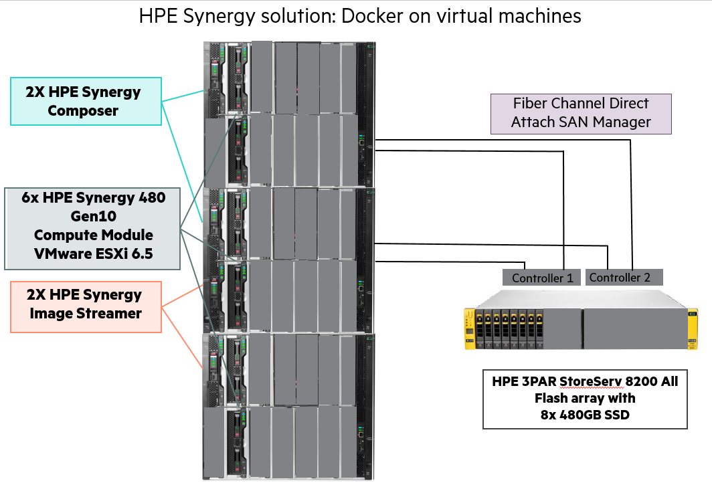
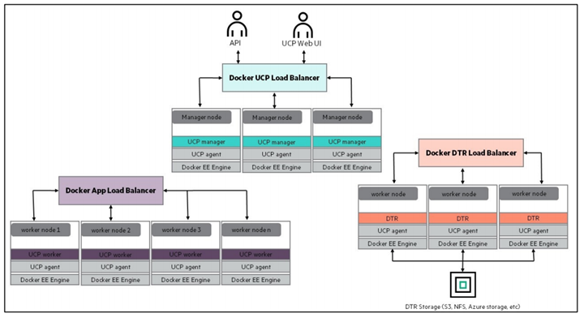
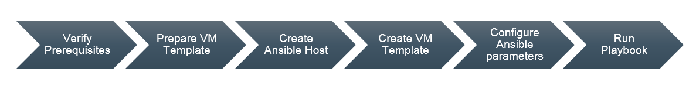
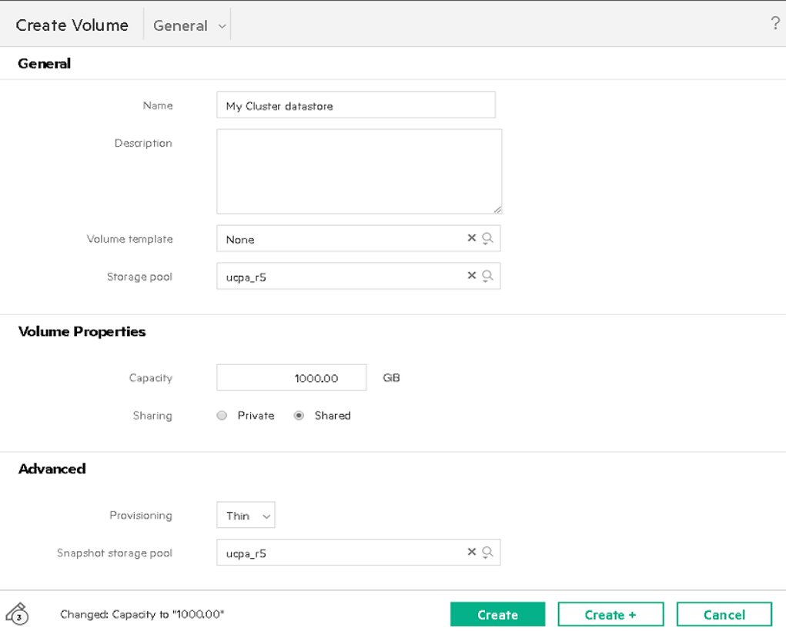

<h1 class="title topictitle1" id="ariaid-title1">Introduction</h1>

HPE Enterprise Containers as a Service with Docker Enterprise Edition (EE) is a
complete solution from Hewlett Packard Enterprise that includes all the hardware,
software, professional services, and support you need to deploy a
containers-as-a-service (CaaS) platform, allowing you to get up and running quickly
and efficiently. The solution takes the HPE Synergy infrastructure and combines it
with Docker’s enterprise-grade container platform, popular open source tools, along
with deployment and advisory services from HPE Pointnext. 

HPE Enterprise Containers as a Service with Docker EE is ideal for customers
migrating legacy applications to containers, transitioning to a container DevOps
development model or needing a hybrid environment to support container and
non-containerized applications on a common VM platform. HPE Enterprise Containers as
a Service with Docker EE provides a solution for IT operations, addressing the need
to have a production ready environment that is very easy to deploy and manage. 

This document describes the best practices for deploying and operating HPE Enterprise
Containers as a Service with Docker EE. It describes how to automate the
provisioning of the environment using a set of Ansible playbooks. It also outlines a
set of manual steps to harden, secure and audit the overall status of the system. 

Note: 

The Ansible playbooks described in this document are only intended for Day 0
deployment automation of Docker EE on HPE Synergy.

The Ansible playbooks described in this document are not directly supported by
HPE and are intended as an example of deploying Docker EE on HPE Synergy. We
welcome input from the user community via GitHub to help us prioritize all
future bug fixes and feature enhancements. 

<h2 class="title topictitle2" id="about-ansible__about-ansible-title">About Ansible</h2>

Ansible is an open-source automation engine that automates software provisioning,
configuration management and application deployment.

As with most configuration management software, Ansible has two types of servers: the
controlling machine and the nodes. A single controlling machine orchestrates the nodes
by deploying modules to the nodes over SSH. The modules are temporarily stored on the
nodes and communicate with the controlling machine through a JSON protocol over the
standard output. When Ansible is not managing nodes, it does not consume resources
because no daemons or programs are executing for Ansible in the background. Ansible uses
one or more inventory files to manage the configuration of the multiple nodes in the
system.

In contrast with other popular configuration management software, such as Chef, Puppet,
and CFEngine, Ansible uses an agentless architecture. With an agent-based architecture,
nodes must have a locally installed daemon that communicates with a controlling machine.
With an agentless architecture, nodes are not required to install and run background
daemons to connect with a controlling machine. This type of architecture reduces the
overhead on the network by preventing the nodes from polling the controlling
machine.

More information about Ansible can be found at: <a class="xref" href="http://docs.ansible.com/" target="_blank">http://docs.ansible.com</a>

<h2 class="title topictitle2" id="ariaid-title3">About Docker Enterprise Edition</h2>

Docker Enterprise Edition (EE) is a leading enterprise containers-as-a-service (CaaS)
software platform for IT that manages and secures diverse applications across disparate
infrastructure, both on-premises and in the cloud. Docker EE provides integrated
container management and security from development to production. Enterprise-ready
capabilities like multi-architecture orchestration and secure software supply chain give
IT teams the ability to manage and secure containers without breaking the developer
experience.

Docker EE provides:

<ul class="ul">
<li class="li">Integrated management of all application resources from a single web admin UI.</li>

<li class="li">Frictionless deployment of applications and Compose files to production in a few clicks.</li>

<li class="li">Multi-tenant system with granular role-based access control (RBAC) and LDAP/AD
integration.</li>

<li class="li">Self-healing application deployment with the ability to apply rolling
application updates.</li>

<li class="li">End-to-end security model with secrets management, image signing and image
security scanning.</li>

</ul>

More information about Docker Enterprise Edition can be found at: <a class="xref" href="https://www.docker.com/enterprise-edition" target="_blank">https://www.docker.com/enterprise-edition</a>

<h2 class="title topictitle2" id="ariaid-title4">HPE Synergy</h2>

HPE Synergy, the first platform built from the ground up for composable infrastructure,
empowers IT to create and deliver new value instantly and continuously. This single
infrastructure reduces operational complexity for traditional workloads and increases
operational velocity for the new breed of applications and services. Through a single
interface, HPE Synergy composes compute, storage and fabric pools into any configuration
for any application. It also enables a broad range of applications from bare metal to
virtual machines to containers, and operational models like hybrid cloud and DevOps. HPE
Synergy enables IT to rapidly react to new business demands.

HPE Synergy Frames contain a management appliance called the HPE Synergy Composer which
hosts HPE OneView. HPE Synergy Composer manages the composable infrastructure and
delivers:

<ul class="ul">
<li class="li">Fluid pools of resources, where a single infrastructure of compute, storage and
fabric boots up ready for workloads and demonstrates self-assimilating capacity. </li>

<li class="li">Software-defined intelligence, with a single interface that precisely composes
logical infrastructures at near-instant speeds; and demonstrates template-driven,
frictionless operations. </li>

<li class="li">Unified API access, which enables simple line-of-code programming of every
infrastructure element; easily automates IT operational processes; and effortlessly
automates applications through infrastructure deployment. </li>

</ul>

<h1 class="title topictitle1" id="ariaid-title5">Architecture</h1>

By default, the Ansible Playbooks will set up a 3 node environment. HPE and Docker
recommend a minimal starter configuration of 3 physical nodes for running Docker in
production. This is the minimal configuration that Docker recommends for cluster HA.
The distribution of the Docker and non-Docker modules over the 3 physical nodes via
virtual machines (VMs) is as follows:

<ul class="ul">
<li class="li">3 Docker Universal Control Plane (UCP) VM nodes for HA and cluster management </li>

<li class="li">3 Docker Trusted Registry (DTR) VM nodes for HA of the container registry </li>

<li class="li">3 Docker Swarm Linux worker VM nodes for container workloads </li>

<li class="li">3 Docker Swarm Windows worker VM nodes for container workloads </li>

<li class="li">1 Docker UCP load balancer VM to ensure access to UCP in the event of a node
failure </li>

<li class="li">1 Docker DTR load balancer VM to ensure access to DTR in the event of a node
failure </li>

<li class="li">1 Docker Swarm Worker node VM load balancer </li>

<li class="li">1 Logging server VM for central logging </li>

<li class="li">1 NFS server VM for storage Docker DTR images </li>

</ul>

In addition to the above, the playbooks also set up:

<ul class="ul">
<li class="li">Docker persistent storage driver from VMware </li>

<li class="li">Prometheus and Grafana monitoring tools </li>

</ul>

These nodes can live in any of the hosts and they are not redundant. The Prometheus
and Grafana services are declared in a Docker stack as replicated services with one
replica each, so if they fail, Docker EE will ensure that they are restarted on one
of the UCP VMs. cAdvisor and node-exporter are declared in the same stack as global
services, so Docker EE will ensure that there is always one copy of each running on
every machine in the cluster. The vSphere Docker volume plug-in stores data in a
shared datastore that can be accessed from any machine in the cluster.

<h2 class="title topictitle2" id="ariaid-title6">Server requirements:</h2>

Two platforms will be described / tested:

<ol class="ol">
<li class="li">3 node HPE Synergy 480 Gen10 deployment with 1 node in each Synergy frame <ul class="ul">
<li class="li">384 GB DDR4-2133 RAM </li>

<li class="li">2 Intel Xeon CPU Gold 6130 2.10GHz x 16 core </li>

<li class="li">single ESXi cluster with control plane and docker workers spread out on all
3 nodes </li>

</ul>

</li>

<li class="li">6 node HPE Synergy 480 Gen 10 deployment with 2 nodes in each Synergy frame <ul class="ul">
<li class="li">384GB DDR4-2133 RAM </li>

<li class="li">2 Intel Xeon CPU Gold 6130 2.10GHz x 16 core </li>

<li class="li">single ESXi cluster with control plane on 3 nodes and 3 nodes dedicated as
Docker workers (should this be 2 clusters?) </li>

</ul>

</li>

</ol>

TBD: How many workers should be deployed on a single ESXi host dedicated to Docker
workers to maximize use of the server and justify the cost of VMware license.

<h2 class="title topictitle2" id="ariaid-title7">Storage requirements:</h2>

3PAR store required for ESXi datastore (block storage)

Currently have 8x 480GB SSD used for datastore

NFS storage - TBD, this needs file persona enabled

will need additional storage for File Persona

Figure 1. HPE Synergy Solution

  

Figure 2. HPE Synergy Configuration

  

<h2 class="title topictitle2" id="ariaid-title8">High availability</h2>

Uptime is paramount for any users implementing Docker containers in business critical
environments. HPE Enterprise Containers with Docker EE offers various levels of high
availability (HA) to support continuous availability. All containers including the
Docker system containers are protected by Docker’s swarm mode. Swarm mode can protect
against individual hardware, network, and container failures based on the user’s
declarative model. The Ansible playbooks can be modified to fit your environment and
your high availability (HA) needs.

<h3 class="title topictitle3" id="ariaid-title9">Load Balancers</h3>

HPE Enterprise Containers with Docker EE also deploys load balancers in the system to
help with container traffic management. There are three load balancer VMs – UCP load
balancer, DTR load balancer, and Docker worker node load balancer. Since these load
balancers exist in VMs, they have some degree of HA but may incur some downtime
during the restoration of these VMs due to a planned or unplanned outage. For
optimal HA configuration, the user should consider implementing a HA load balancer
architecture using the Virtual Router Redundancy Protocol (VRRP). For more
information see <a class="xref" href="http://www.haproxy.com/solutions/high-availability/" target="_blank">http://www.haproxy.com/solutions/high-availability/</a>.

Figure 3. Load balancer architecture

<h2 class="title topictitle2" id="ariaid-title10">Sizing considerations</h2>

A node is a machine in the cluster (virtual or physical) with Docker Engine running on
it. When provisioning each node, assign it a role: UCP Controller, DTR, or worker node
so that it is protected from running application workloads.

To decide what size the node should be in terms of CPU, RAM, and storage resources,
consider the following:

<ol class="ol">
<li class="li">All nodes should at least fulfil the minimal requirements, for UCP 2.0, 2GB of RAM
and 3GB of storage. More detailed requirements are in the UCP documentation. </li>

<li class="li">UCP Controller nodes should be provided with more than the minimal requirements, but
won’t need much more if nothing else runs on them. </li>

<li class="li">Ideally, worker node size will vary based on your workloads so it is impossible to
define a universal standard size. </li>

<li class="li">Other considerations like target density (average number of containers per node),
whether one standard node type or several are preferred, and other operational
considerations might also influence sizing. </li>

</ol>

If possible, node size should be determined by experimentation and testing actual
workloads; and they should be refined iteratively. A good starting point is to select a
standard or default machine type in your environment and use this size only. If your
standard machine type provides more resources than the UCP Controllers need, it makes
sense to have a smaller node size for these. Whatever the starting choice, it is
important to monitor resource usage and cost to improve the model.

For HPE Enterprise Containers with Docker EE: Ops Edition, the following tables describe
sizing configurations. The vCPU allocations are described in Table 1 while the memory
allocation is described in Table 2.

<table cellpadding="4" cellspacing="0" summary="" class="table" frame="void" border="1" rules="all"><caption>Table 1. vCPU</caption><colgroup><col /><col /><col /><col /></colgroup><thead class="thead" style="text-align:left;">
<tr class="row">
<th class="entry nocellnorowborder" style="text-align:left;vertical-align:top;" id="d29e965">vCPUs</th>
<th class="entry nocellnorowborder" style="text-align:center;vertical-align:top;" id="d29e968">node01</th>
<th class="entry nocellnorowborder" style="text-align:center;vertical-align:top;" id="d29e971">node02</th>
<th class="entry nocellnorowborder" style="text-align:center;vertical-align:top;" id="d29e974">node03</th>
</tr>
</thead><tbody class="tbody">

<tr class="row">
<td class="entry nocellnorowborder" style="text-align:left;vertical-align:top;" headers="d29e965 ">ucp1</td>
<td class="entry nocellnorowborder" style="text-align:center;vertical-align:top;" headers="d29e968 ">4</td>
<td class="entry nocellnorowborder" style="text-align:center;vertical-align:top;" headers="d29e971 "> </td>
<td class="entry nocellnorowborder" style="text-align:center;vertical-align:top;" headers="d29e974 "> </td>
</tr>

<tr class="row">
<td class="entry nocellnorowborder" style="text-align:left;vertical-align:top;" headers="d29e965 ">ucp2</td>
<td class="entry nocellnorowborder" style="text-align:center;vertical-align:top;" headers="d29e968 "> </td>
<td class="entry nocellnorowborder" style="text-align:center;vertical-align:top;" headers="d29e971 ">4</td>
<td class="entry nocellnorowborder" style="text-align:center;vertical-align:top;" headers="d29e974 "> </td>
</tr>

<tr class="row">
<td class="entry nocellnorowborder" style="text-align:left;vertical-align:top;" headers="d29e965 ">ucp3</td>
<td class="entry nocellnorowborder" style="text-align:center;vertical-align:top;" headers="d29e968 "> </td>
<td class="entry nocellnorowborder" style="text-align:center;vertical-align:top;" headers="d29e971 "> </td>
<td class="entry nocellnorowborder" style="text-align:center;vertical-align:top;" headers="d29e974 ">4</td>
</tr>

<tr class="row">
<td class="entry nocellnorowborder" style="text-align:left;vertical-align:top;" headers="d29e965 ">dtr1</td>
<td class="entry nocellnorowborder" style="text-align:center;vertical-align:top;" headers="d29e968 ">2</td>
<td class="entry nocellnorowborder" style="text-align:center;vertical-align:top;" headers="d29e971 "> </td>
<td class="entry nocellnorowborder" style="text-align:center;vertical-align:top;" headers="d29e974 "> </td>
</tr>

<tr class="row">
<td class="entry nocellnorowborder" style="text-align:left;vertical-align:top;" headers="d29e965 ">
dtr2
</td>
<td class="entry nocellnorowborder" style="text-align:center;vertical-align:top;" headers="d29e968 ">

</td>
<td class="entry nocellnorowborder" style="text-align:center;vertical-align:top;" headers="d29e971 ">
2
</td>
<td class="entry nocellnorowborder" style="text-align:center;vertical-align:top;" headers="d29e974 ">

</td>
</tr>

<tr class="row">
<td class="entry nocellnorowborder" style="text-align:left;vertical-align:top;" headers="d29e965 ">
dtr3
</td>
<td class="entry nocellnorowborder" style="text-align:center;vertical-align:top;" headers="d29e968 ">

</td>
<td class="entry nocellnorowborder" style="text-align:center;vertical-align:top;" headers="d29e971 ">

</td>
<td class="entry nocellnorowborder" style="text-align:center;vertical-align:top;" headers="d29e974 ">
2
</td>
</tr>
<tr class="row">
<td class="entry nocellnorowborder" style="text-align:left;vertical-align:top;" headers="d29e965 ">
worker1
</td>
<td class="entry nocellnorowborder" style="text-align:center;vertical-align:top;" headers="d29e968 ">
4
</td>
<td class="entry nocellnorowborder" style="text-align:center;vertical-align:top;" headers="d29e971 ">

</td>
<td class="entry nocellnorowborder" style="text-align:center;vertical-align:top;" headers="d29e974 ">

</td>
</tr>
<tr class="row">
<td class="entry nocellnorowborder" style="text-align:left;vertical-align:top;" headers="d29e965 ">
worker2
</td>
<td class="entry nocellnorowborder" style="text-align:center;vertical-align:top;" headers="d29e968 ">

</td>
<td class="entry nocellnorowborder" style="text-align:center;vertical-align:top;" headers="d29e971 ">
4
</td>
<td class="entry nocellnorowborder" style="text-align:center;vertical-align:top;" headers="d29e974 ">

</td>
</tr>
<tr class="row">
<td class="entry nocellnorowborder" style="text-align:left;vertical-align:top;" headers="d29e965 ">
worker3
</td>
<td class="entry nocellnorowborder" style="text-align:center;vertical-align:top;" headers="d29e968 ">

</td>
<td class="entry nocellnorowborder" style="text-align:center;vertical-align:top;" headers="d29e971 ">

</td>
<td class="entry nocellnorowborder" style="text-align:center;vertical-align:top;" headers="d29e974 ">
4
</td>
</tr>
<tr class="row">
<td class="entry nocellnorowborder" style="text-align:left;vertical-align:top;" headers="d29e965 ">win-worker1</td>
<td class="entry nocellnorowborder" style="text-align:center;vertical-align:top;" headers="d29e968 ">4</td>
<td class="entry nocellnorowborder" style="text-align:center;vertical-align:top;" headers="d29e971 "> </td>
<td class="entry nocellnorowborder" style="text-align:center;vertical-align:top;" headers="d29e974 "> </td>
</tr>
<tr class="row">
<td class="entry nocellnorowborder" style="text-align:left;vertical-align:top;" headers="d29e965 ">win-worker2</td>
<td class="entry nocellnorowborder" style="text-align:center;vertical-align:top;" headers="d29e968 "> </td>
<td class="entry nocellnorowborder" style="text-align:center;vertical-align:top;" headers="d29e971 ">4</td>
<td class="entry nocellnorowborder" style="text-align:center;vertical-align:top;" headers="d29e974 "> </td>
</tr>
<tr class="row">
<td class="entry nocellnorowborder" style="text-align:left;vertical-align:top;" headers="d29e965 ">win-worker3</td>
<td class="entry nocellnorowborder" style="text-align:center;vertical-align:top;" headers="d29e968 "> </td>
<td class="entry nocellnorowborder" style="text-align:center;vertical-align:top;" headers="d29e971 "> </td>
<td class="entry nocellnorowborder" style="text-align:center;vertical-align:top;" headers="d29e974 ">4</td>
</tr>
<tr class="row">
<td class="entry nocellnorowborder" style="text-align:left;vertical-align:top;" headers="d29e965 ">
ucb_lb
</td>
<td class="entry nocellnorowborder" style="text-align:center;vertical-align:top;" headers="d29e968 ">
2
</td>
<td class="entry nocellnorowborder" style="text-align:center;vertical-align:top;" headers="d29e971 ">

</td>
<td class="entry nocellnorowborder" style="text-align:center;vertical-align:top;" headers="d29e974 ">

</td>
</tr>
<tr class="row">
<td class="entry nocellnorowborder" style="text-align:left;vertical-align:top;" headers="d29e965 ">
dtr_lb
</td>
<td class="entry nocellnorowborder" style="text-align:center;vertical-align:top;" headers="d29e968 ">

</td>
<td class="entry nocellnorowborder" style="text-align:center;vertical-align:top;" headers="d29e971 ">
2
</td>
<td class="entry nocellnorowborder" style="text-align:center;vertical-align:top;" headers="d29e974 ">

</td>
</tr>
<tr class="row">
<td class="entry nocellnorowborder" style="text-align:left;vertical-align:top;" headers="d29e965 ">
worker_lb
</td>
<td class="entry nocellnorowborder" style="text-align:center;vertical-align:top;" headers="d29e968 ">

</td>
<td class="entry nocellnorowborder" style="text-align:center;vertical-align:top;" headers="d29e971 ">

</td>
<td class="entry nocellnorowborder" style="text-align:center;vertical-align:top;" headers="d29e974 ">
2
</td>
</tr>
<tr class="row">
<td class="entry nocellnorowborder" style="text-align:left;vertical-align:top;" headers="d29e965 ">
nfs
</td>
<td class="entry nocellnorowborder" style="text-align:center;vertical-align:top;" headers="d29e968 ">

</td>
<td class="entry nocellnorowborder" style="text-align:center;vertical-align:top;" headers="d29e971 ">

</td>
<td class="entry nocellnorowborder" style="text-align:center;vertical-align:top;" headers="d29e974 ">
2
</td>
</tr>
<tr class="row">
<td class="entry nocellnorowborder" style="text-align:left;vertical-align:top;" headers="d29e965 ">
logger
</td>
<td class="entry nocellnorowborder" style="text-align:center;vertical-align:top;" headers="d29e968 ">

</td>
<td class="entry nocellnorowborder" style="text-align:center;vertical-align:top;" headers="d29e971 ">
2
</td>
<td class="entry nocellnorowborder" style="text-align:center;vertical-align:top;" headers="d29e974 ">

</td>
</tr>
<tr class="row">
<td class="entry nocellnorowborder" style="text-align:left;vertical-align:top;" headers="d29e965 ">
Total vCPU per node
</td>
<td class="entry nocellnorowborder" style="text-align:center;vertical-align:top;" headers="d29e968 ">
12
</td>
<td class="entry nocellnorowborder" style="text-align:center;vertical-align:top;" headers="d29e971 ">
14
</td>
<td class="entry nocellnorowborder" style="text-align:center;vertical-align:top;" headers="d29e974 ">
14
</td>
</tr>
</tbody></table>

Note: 

In the case of one ESX host failure, two nodes are enough to accommodate the amount
of vCPU required

<table cellpadding="4" cellspacing="0" summary="" class="table" frame="border" border="1" rules="all"><caption>Table 2. Memory allocation</caption><colgroup><col /><col /><col /><col /></colgroup><thead class="thead" style="text-align:left;">
<tr class="row">
<th class="entry nocellnorowborder" style="text-align:left;vertical-align:top;" id="d29e1275">RAM (GB)</th>
<th class="entry nocellnorowborder" style="text-align:center;vertical-align:top;" id="d29e1278">node01</th>
<th class="entry nocellnorowborder" style="text-align:center;vertical-align:top;" id="d29e1281">node02</th>
<th class="entry cell-norowborder" style="text-align:center;vertical-align:top;" id="d29e1284">node03</th>
</tr>
</thead><tbody class="tbody">		

<tr class="row">
<td class="entry nocellnorowborder" style="text-align:left;vertical-align:top;" headers="d29e1275 ">ucp1</td>
<td class="entry nocellnorowborder" style="text-align:center;vertical-align:top;" headers="d29e1278 ">8</td>
<td class="entry nocellnorowborder" style="text-align:center;vertical-align:top;" headers="d29e1281 "> </td>
<td class="entry cell-norowborder" style="text-align:center;vertical-align:top;" headers="d29e1284 "> </td>
</tr>

<tr class="row">
<td class="entry nocellnorowborder" style="text-align:left;vertical-align:top;" headers="d29e1275 ">ucp2</td>
<td class="entry nocellnorowborder" style="text-align:center;vertical-align:top;" headers="d29e1278 "> </td>							
<td class="entry nocellnorowborder" style="text-align:center;vertical-align:top;" headers="d29e1281 ">8</td>
<td class="entry cell-norowborder" style="text-align:center;vertical-align:top;" headers="d29e1284 "> </td>
</tr>

<tr class="row">
<td class="entry nocellnorowborder" style="text-align:left;vertical-align:top;" headers="d29e1275 ">ucp3</td>
<td class="entry nocellnorowborder" style="text-align:center;vertical-align:top;" headers="d29e1278 "> </td>
<td class="entry nocellnorowborder" style="text-align:center;vertical-align:top;" headers="d29e1281 "> </td>
<td class="entry cell-norowborder" style="text-align:center;vertical-align:top;" headers="d29e1284 ">8</td>
</tr>

<tr class="row">
<td class="entry nocellnorowborder" style="text-align:left;vertical-align:top;" headers="d29e1275 ">dtr1</td>
<td class="entry nocellnorowborder" style="text-align:center;vertical-align:top;" headers="d29e1278 ">16</td>
<td class="entry nocellnorowborder" style="text-align:center;vertical-align:top;" headers="d29e1281 "> </td>
<td class="entry cell-norowborder" style="text-align:center;vertical-align:top;" headers="d29e1284 "> </td>
</tr>

<tr class="row">
<td class="entry nocellnorowborder" style="text-align:left;vertical-align:top;" headers="d29e1275 ">dtr2</td>
<td class="entry nocellnorowborder" style="text-align:center;vertical-align:top;" headers="d29e1278 "> </td>
<td class="entry nocellnorowborder" style="text-align:center;vertical-align:top;" headers="d29e1281 ">16</td>
<td class="entry cell-norowborder" style="text-align:center;vertical-align:top;" headers="d29e1284 "> </td>
</tr>

<tr class="row">
<td class="entry nocellnorowborder" style="text-align:left;vertical-align:top;" headers="d29e1275 ">dtr3</td>
<td class="entry nocellnorowborder" style="text-align:center;vertical-align:top;" headers="d29e1278 "> </td>
<td class="entry nocellnorowborder" style="text-align:center;vertical-align:top;" headers="d29e1281 "> </td>
<td class="entry cell-norowborder" style="text-align:center;vertical-align:top;" headers="d29e1284 ">16</td>
</tr>

<tr class="row">
<td class="entry nocellnorowborder" style="text-align:left;vertical-align:top;" headers="d29e1275 ">worker1</td>
<td class="entry nocellnorowborder" style="text-align:center;vertical-align:top;" headers="d29e1278 ">64</td>
<td class="entry nocellnorowborder" style="text-align:center;vertical-align:top;" headers="d29e1281 "> </td>
<td class="entry cell-norowborder" style="text-align:center;vertical-align:top;" headers="d29e1284 "> </td>
</tr>

<tr class="row">
<td class="entry nocellnorowborder" style="text-align:left;vertical-align:top;" headers="d29e1275 ">worker2</td>
<td class="entry nocellnorowborder" style="text-align:center;vertical-align:top;" headers="d29e1278 "> </td>
<td class="entry nocellnorowborder" style="text-align:center;vertical-align:top;" headers="d29e1281 ">64</td>
<td class="entry cell-norowborder" style="text-align:center;vertical-align:top;" headers="d29e1284 "> </td>
</tr>

<tr class="row">
<td class="entry nocellnorowborder" style="text-align:left;vertical-align:top;" headers="d29e1275 ">worker3</td>
<td class="entry nocellnorowborder" style="text-align:center;vertical-align:top;" headers="d29e1278 "> </td>
<td class="entry nocellnorowborder" style="text-align:center;vertical-align:top;" headers="d29e1281 "> </td>
<td class="entry cell-norowborder" style="text-align:center;vertical-align:top;" headers="d29e1284 ">64</td>
</tr>

<tr class="row">
<td class="entry nocellnorowborder" style="text-align:left;vertical-align:top;" headers="d29e1275 ">win-worker1</td>
<td class="entry nocellnorowborder" style="text-align:center;vertical-align:top;" headers="d29e1278 ">64</td>
<td class="entry nocellnorowborder" style="text-align:center;vertical-align:top;" headers="d29e1281 "> </td>
<td class="entry cell-norowborder" style="text-align:center;vertical-align:top;" headers="d29e1284 "> </td>
</tr>

<tr class="row">
<td class="entry nocellnorowborder" style="text-align:left;vertical-align:top;" headers="d29e1275 ">win-worker2</td>
<td class="entry nocellnorowborder" style="text-align:center;vertical-align:top;" headers="d29e1278 "> </td>
<td class="entry nocellnorowborder" style="text-align:center;vertical-align:top;" headers="d29e1281 ">64</td>
<td class="entry cell-norowborder" style="text-align:center;vertical-align:top;" headers="d29e1284 "> </td>
</tr>

<tr class="row">
<td class="entry nocellnorowborder" style="text-align:left;vertical-align:top;" headers="d29e1275 ">win-worker3</td>
<td class="entry nocellnorowborder" style="text-align:center;vertical-align:top;" headers="d29e1278 "> </td>
<td class="entry nocellnorowborder" style="text-align:center;vertical-align:top;" headers="d29e1281 "> </td>
<td class="entry cell-norowborder" style="text-align:center;vertical-align:top;" headers="d29e1284 ">64</td>
</tr>

<tr class="row">
<td class="entry nocellnorowborder" style="text-align:left;vertical-align:top;" headers="d29e1275 ">ucb_lb</td>
<td class="entry nocellnorowborder" style="text-align:center;vertical-align:top;" headers="d29e1278 ">4</td>
<td class="entry nocellnorowborder" style="text-align:center;vertical-align:top;" headers="d29e1281 "> </td>
<td class="entry cell-norowborder" style="text-align:center;vertical-align:top;" headers="d29e1284 "> </td>
</tr>

<tr class="row">
<td class="entry nocellnorowborder" style="text-align:left;vertical-align:top;" headers="d29e1275 ">dtr_lb</td>
<td class="entry nocellnorowborder" style="text-align:center;vertical-align:top;" headers="d29e1278 "> </td>
<td class="entry nocellnorowborder" style="text-align:center;vertical-align:top;" headers="d29e1281 ">4</td>
<td class="entry cell-norowborder" style="text-align:center;vertical-align:top;" headers="d29e1284 "> </td>
</tr>

<tr class="row">
<td class="entry nocellnorowborder" style="text-align:left;vertical-align:top;" headers="d29e1275 ">worker_lb</td>
<td class="entry nocellnorowborder" style="text-align:center;vertical-align:top;" headers="d29e1278 "> </td>
<td class="entry nocellnorowborder" style="text-align:center;vertical-align:top;" headers="d29e1281 "> </td>
<td class="entry cell-norowborder" style="text-align:center;vertical-align:top;" headers="d29e1284 ">4</td>
</tr>

<tr class="row">
<td class="entry nocellnorowborder" style="text-align:left;vertical-align:top;" headers="d29e1275 ">nfs</td>
<td class="entry nocellnorowborder" style="text-align:center;vertical-align:top;" headers="d29e1278 "> </td>
<td class="entry nocellnorowborder" style="text-align:center;vertical-align:top;" headers="d29e1281 "> </td>
<td class="entry cell-norowborder" style="text-align:center;vertical-align:top;" headers="d29e1284 ">4</td>
</tr>

<tr class="row">
<td class="entry nocellnorowborder" style="text-align:left;vertical-align:top;" headers="d29e1275 ">logger</td>
<td class="entry nocellnorowborder" style="text-align:center;vertical-align:top;" headers="d29e1278 "> </td>
<td class="entry nocellnorowborder" style="text-align:center;vertical-align:top;" headers="d29e1281 ">4</td>
<td class="entry cell-norowborder" style="text-align:center;vertical-align:top;" headers="d29e1284 "> </td>
</tr>

<tr class="row">
<td class="entry nocellnorowborder" style="text-align:left;vertical-align:top;" headers="d29e1275 ">Total RAM required (per node)</td>
<td class="entry nocellnorowborder" style="text-align:center;vertical-align:top;" headers="d29e1278 ">92</td>
<td class="entry nocellnorowborder" style="text-align:center;vertical-align:top;" headers="d29e1281 ">96</td>
<td class="entry cell-norowborder" style="text-align:center;vertical-align:top;" headers="d29e1284 ">96</td>
</tr>

<tr class="row">
<td class="entry nocellnorowborder" style="text-align:left;vertical-align:top;" headers="d29e1275 ">Total RAM required</td>
<td class="entry nocellnorowborder" style="text-align:center;vertical-align:top;" headers="d29e1278 "> </td>
<td class="entry nocellnorowborder" style="text-align:center;vertical-align:top;" headers="d29e1281 ">284</td>
<td class="entry cell-norowborder" style="text-align:center;vertical-align:top;" headers="d29e1284 "> </td>
</tr>

<tr class="row">
<td class="entry row-nocellborder" style="text-align:left;vertical-align:top;" headers="d29e1275 ">Available RAM</td>
<td class="entry row-nocellborder" style="text-align:center;vertical-align:top;" headers="d29e1278 ">384</td>
<td class="entry row-nocellborder" style="text-align:center;vertical-align:top;" headers="d29e1281 ">384</td>
<td class="entry cellrowborder" style="text-align:center;vertical-align:top;" headers="d29e1284 ">384</td>
</tr>
</tbody></table>

Note: 

In the case of one ESX host failure, the two surviving hosts can accommodate the
amount of RAM required for all VMs.

<h2 class="title topictitle2" id="ariaid-title11">Disaster Recovery</h2>

In order to protect your installation from disasters, you need to take regular backups of
the swarm, UCP and DTR. In the event where half or more manager nodes are lost and
cannot be recovered to a healthy state, the system is considered to have lost quorum and
can only be restored through the manual procedure described in the Docker
documentation.

For more information, see <a class="xref" href="https://docs.docker.com/datacenter/ucp/2.2/guides/admin/backups-and-disaster-recovery/" target="_blank">https://docs.docker.com/datacenter/ucp/2.2/guides/admin/backups-and-disaster-recovery/</a>.

<h2 class="title topictitle2" id="ariaid-title12">Security</h2>

The Docker Reference architecture for Securing Docker EE and Security Best Practices is
available at <a class="xref" href="https://success.docker.com/article/Docker_Reference_Architecture-_Securing_Docker_EE_and_Security_Best_Practices" target="_blank">https://success.docker.com/article/Docker_Reference_Architecture-_Securing_Docker_EE_and_Security_Best_Practices</a>

In addition to having all logs centralized in a single place and the image scanning
feature enabled for the DTR nodes, there are other guidelines that should be followed in
order to keep your Docker environment as secure as possible. The HPE Reference
Configuration paper for securing Docker on HPE Hardware places a special emphasis on
securing Docker in DevOps environments and covers best practices in terms of Docker
security. The document can be found at: <a class="xref" href="http://h20195.www2.hpe.com/V2/GetDocument.aspx?docname=a00020437enw" target="_blank">http://h20195.www2.hpe.com/V2/GetDocument.aspx?docname=a00020437enw</a>. Some
newer Docker security features that were not covered in the reference configuration are
outlined below.

<h3 class="title topictitle3" id="ariaid-title13">Prevent tags from being overwritten</h3>

By default, an image tag can be overwritten by a user with the correct access rights.
As an example, an image such as library/wordpress:latest can be pushed and tagged by
different users, yet have different functionality. This might make it difficult to
trace back the image to the build that generated it.

Docker DTR can prevent this from happening with the immutable tags feature that can
be configured on a per repository basis. Once an image is pushed with a tag, that
particular tag cannot be overwritten.

More information about immutable tags can be found at: <a class="xref" href="https://docs.docker.com/datacenter/dtr/2.3/guides/user/manage-images/prevent-tags-from-being-overwritten/%20" target="_blank">https://docs.docker.com/datacenter/dtr/2.3/guides/user/manage-images/prevent-tags-from-being-overwritten/</a>

<h3 class="title topictitle3" id="ariaid-title14">Isolate swarm nodes to a specific team</h3>

With Docker EE Advanced, you can enable physical isolation of resources by organizing
nodes into collections and granting Scheduler access for different users. To control
access to nodes, move them to dedicated collections where you can grant access to
specific users, teams, and organizations.

More information about this subject can be found at: <a class="xref" href="https://docs.docker.com/datacenter/ucp/2.2/guides/access-control/isolate-volumes-between-teams/" target="_blank">https://docs.docker.com/datacenter/ucp/2.2/guides/access-control/isolate-volumes-between-teams/</a>.

<h1 class="title topictitle1" id="ariaid-title15">Provisioning the environment</h1>

This section describes in detail how to provision the environment described
previously in the architecture section. The high level steps this guide will take
are shown in the figure:

Figure 4. Provisioning steps

<h2 class="title topictitle2" id="ariaid-title16">Creating ESXi hosts with OneView and Image Streamer</h2>

OneView/Composer: 10.60.50.10

A 3PAR (StoreServ 8200 All-Flash) is used for ESXi cluster storage in the Synergy
environment and is connected via FCOE. The 3PAR in the Synergy environment is managed by
OneView. Storage for the ESXi cluster can be configured in OneView and assigned in the
server profile so that the storage is automatically attached when the server is
deployed.

Two volumes are necessary for an ESXi cluster, the large datastore for VM deployments and
a smaller (10GB is fine) quorum disk. From OneView menu, select Volumes and Create
Volume.

<ul class="ul">
<li class="li">Specify a unique name for the datastore</li>

<li class="li">The storage pool for this environment is ucpa_r5.</li>

<li class="li">Specify a size</li>

<li class="li">Select Shared</li>

<li class="li">Leave it as Thin provisioned and then select Create.</li>

</ul>

Figure 5. Create volume

Use the server profile template ESXi-6.5 for Docker to create a new server profile for an
ESXi host. The server profile template uses the Image Streamer Deployment plan (ESXi
Deployment SAN and Docker enabled) to deploy ESXi 6.5 and prepare it for use.

From the Action drop down menu, select Create the server profile.

You will be asked for

<ul class="ul">
<li class="li">Unique Server Profile name</li>

<li class="li">Location to deploy (drop down will give you the list of available compute
modules)</li>

</ul>

The following attributes are used by the Image Streamer scripts to customize the ESXi 6.5
golden image:

<ul class="ul">
<li class="li">Hostname: provide the short name here. It will set the domain to cloudra.local</li>

<li class="li">Networking information (Management network is VLAN60)</li>

</ul>

<ul class="ul">
<li class="li">
<ul class="ul">
<li class="li">IP address: provide the IP address on VLAN60.</li>

<li class="li">Netmask: 255.255.0.0</li>

<li class="li">Gateway: 10.60.0.1</li>

<li class="li">DNS1: 10.60.50.106</li>

<li class="li">DNS2: 10.60.1.53</li>

</ul>

</li>

</ul>

Note, you have to manually add the hostname + address to the DNS server at 10.60.50.106
since this is not automated.

Storage customization for datastores:

The networks should be set from the template. The networks are configured for High
Availability so there are 2 of each:

<ul class="ul">
<li class="li">2 Deployment networks which are connected to the Image Streamer</li>

<li class="li">2 networks on MGMT1 (VLAN 60)</li>

<li class="li">2 FC networks for Storage connectivity, SAN-A, SAN-B</li>

<li class="li">2 vMotion networks</li>

</ul>

The Storage may have to be modified depending on which cluster you are joining. If you
need different volumes, delete the ones that were added for you and then add the new
ones.

When you are done with Storage changes, click Create to start the process to create the
server profile on the selected compute host.

After the profile is applied, use the Actions drop down to power on the server.

As it powers on you will probably see connectivity error messages such as this:

This error will (should!) clear once the server boots completely.

Use the Actions Drop down to open the iLO session to verify the server booted
completely.

You should see the hostname and the IP set as specified in the server profile. After we
get this host into vCenter and deploy the vSphere docker plugin we will use the iLO to
restart the hostd service.

Additional networking (ie vMotion) , distributed switches, attaching the datastore, etc
is all manual setup using the vSphere client. All vCenter setup is manual
(vcenter.cloudra.local/10.60.50.103). There are some licenses for compute hosts
available though they all expire in March 2018.

<h2 class="title topictitle2" id="ariaid-title17">Deploying the vSphere Volume PlugIn</h2>

<strong class="ph b">Editors Note</strong>: I had attempted to add the vSphere Volume plugin to the ESXi golden
image but it does not work. I have reported this issue to the Image Streamer team. The
ESXi 6.5 image can't be modified. All changes are lost as soon as it reboots. The
existing Image Streamer capture ESXi scripts to create golden images which are supposed
to remove all customizations also do not work. The only thing I could get to work is
creating the "vanilla" ESXi 6.5 golden image and using the existing Image Streamer
scripts to do the customization. Therefore, the addition of the vSphere Volume Plugin is
not automated. Using the vSphere Update Manager seemed like the best option however even
that requires additional steps as the package provided by VMware doesn't restart the
hostd service and the plugin is unusable until you do that.

After the new ESXi host is imported into vCenter, you can use the vSphere Update manager
to install the vSphere Volume PlugIn.

<ul class="ul">
<li class="li">From vSphere Web Client, select your ESXi host</li>

<li class="li">Select the Update Manager tab</li>

</ul>

<ul class="ul">
<li class="li">Attach the baseline "ESXi 6.5 Docker Patch Extension" to your host.</li>

</ul>

<ul class="ul">
<li class="li">Select Scan for Updates and choose Patches and Extensions</li>

</ul>

<ul class="ul">
<li class="li">Select Remediate - you should see the VDVS_Driver BuiltIn</li>

</ul>

<ul class="ul">
<li class="li">Keep the defaults for the Advanced and remediation options, click Finish. It doesn't
refresh automatically but you can select anything else and return to this page and
it should show that host is now compliant.</li>

</ul>

The Docker Extension is now installed on the ESXi host but you have to restart the
service in order to use it. Going back to the iLO session, you can select Alt F1 to go
to the CLI and restart the hostd service. After logging in, enter

<ul class="ul">
<li class="li">/etc/init.d/hostd restart</li>

</ul>

If you use the esxcli storage guestvol command you can now see the status.

<h2 class="title topictitle2" id="ariaid-title18">Verify prerequisites</h2>

You must assemble the information required to assign values for each and every variable
used by the playbooks, before you start deployment. The variables are fully documented
in the following sections “Editing the group variables” and “Editing the vault”. A
summary of the information required is presented in Table 3.

<table cellpadding="4" cellspacing="0" summary="" class="table" frame="void" border="1" rules="all"><caption>Table 3. Summary of information required</caption><colgroup><col /><col /></colgroup><thead class="thead" style="text-align:left;">
<tr class="row">
<th class="entry nocellnorowborder" style="text-align:left;vertical-align:top;" id="d29e1937">Component </th>
<th class="entry nocellnorowborder" style="text-align:left;vertical-align:top;" id="d29e1940">Details </th>
</tr>
</thead><tbody class="tbody">
<tr class="row">
<td class="entry nocellnorowborder" style="text-align:left;vertical-align:top;" headers="d29e1937 ">Virtual Infrastructure </td>
<td class="entry nocellnorowborder" style="text-align:left;vertical-align:top;" headers="d29e1940 ">The FQDN of your vCenter server and the name of the Datacenter. You
will also need administrator credentials in order to create templates,
and spin up virtual machines. </td>
</tr>
<tr class="row">
<td class="entry nocellnorowborder" style="text-align:left;vertical-align:top;" headers="d29e1937 ">L3 Network requirements </td>
<td class="entry nocellnorowborder" style="text-align:left;vertical-align:top;" headers="d29e1940 ">You will need one IP address for each and every VM configured in the
Ansible inventory (see the section “Editing the inventory”). At the time
of writing, the example inventory configures 14 virtual machines so you
would need to allocate 14 IP addresses to use this example inventory.
Note that the Ansible playbooks do not support DHCP so you need static
IP addresses. All the IPs should be in the same subnet. You will also
have to specify the size of the subnet (for example /22 or /24) and the
L3 gateway for this subnet. </td>
</tr>
<tr class="row">
<td class="entry nocellnorowborder" style="text-align:left;vertical-align:top;" headers="d29e1937 ">DNS </td>
<td class="entry nocellnorowborder" style="text-align:left;vertical-align:top;" headers="d29e1940 ">You will need to know the IP addresses of your DNS server. In
addition, all the VMs you configure in the inventory should have their
names registered in DNS. In addition, you will need the domain name to
use for configuring the virtual machines (such as <a class="xref" href="http://example.com/" target="_blank">example.com</a>)
</td>
</tr>
<tr class="row">
<td class="entry nocellnorowborder" style="text-align:left;vertical-align:top;" headers="d29e1937 ">NTP Services </td>
<td class="entry nocellnorowborder" style="text-align:left;vertical-align:top;" headers="d29e1940 ">You need time services configured in your environment. The solution
being deployed (including Docker) uses certificates and certificates are
time sensitive. You will need the IP addresses of your time servers
(NTP). </td>
</tr>
<tr class="row">
<td class="entry nocellnorowborder" style="text-align:left;vertical-align:top;" headers="d29e1937 ">RHEL Subscription </td>
<td class="entry nocellnorowborder" style="text-align:left;vertical-align:top;" headers="d29e1940 ">A RHEL subscription is required to pull extra packages that are not
on the DVD. </td>
</tr>
<tr class="row">
<td class="entry nocellnorowborder" style="text-align:left;vertical-align:top;" headers="d29e1937 ">Docker Prerequisites </td>
<td class="entry nocellnorowborder" style="text-align:left;vertical-align:top;" headers="d29e1940 ">You will need a URL for the official Docker EE software download and
a license file. Refer to the Docker documentation to learn more about
this URL and the licensing requirements at: <a class="xref" href="https://docs.docker.com/engine/installation/linux/docker-ee/rhel/" target="_blank">https://docs.docker.com/engine/installation/linux/docker-ee/rhel/</a>
in the section entitled “Docker EE repository URL” </td>
</tr>
<tr class="row">
<td class="entry nocellnorowborder" style="text-align:left;vertical-align:top;" headers="d29e1937 ">Proxy </td>
<td class="entry nocellnorowborder" style="text-align:left;vertical-align:top;" headers="d29e1940 ">The playbooks pull the Docker packages from the Internet. If your
environment accesses the Internet through a proxy, you will need the
details of the proxy including the fully qualified domain name and the
port number. </td>
</tr>
</tbody></table>

<h2 class="title topictitle2" id="ariaid-title19">Enable vSphere High Availability</h2>

You must enable vSphere High Availability (HA) to support virtual machine failover during
an HA event such as a host failure. Sufficient CPU and memory resources must be reserved
across the system so that all VMs on the affected host(s) can fail over to remaining
available hosts in the system. You configure an Admission Control Policy (ACP) to
specify the percentage CPU and memory to reserve on all the hosts in the cluster to
support HA functionality.

Note: 

You should not use the default Admission Control Policy. Instead, you should
calculate the memory and CPU requirements that are specific to your environment.

<h2 class="title topictitle2" id="ariaid-title20">Install vSphere Docker Volume Service driver on all ESXi hosts</h2>

vSphere Docker Volume Service technology enables stateful containers to access the
storage volumes. This is a one-off manual step. In order to be able to use Docker
volumes using the vSphere driver, you must first install the latest release of the
vSphere Docker Volume Service (vDVS) driver, which is available as a vSphere
Installation Bundle (VIB). To perform this operation, log in to each of the ESXi hosts,
download and install the latest release of vDVS driver.

<pre class="pre codeblock"><code># esxcli software vib install -v /tmp/vmware-esx-vmdkops-&lt;version&gt;.vib --no-sig-check</code></pre>

More information on how to download and install the driver can be found at <a class="xref" href="http://vmware.github.io/vsphere-storage-for-docker/documentation/install.html" target="_blank">http://vmware.github.io/vsphere-storage-for-docker/documentation/install.html</a>

Note: 

You cannot mount the same persistent volume created through vSphere Docker Volume
Service (vDVS) on containers running on two different hosts at the same time.

<h2 class="title topictitle2" id="ariaid-title21">Install vSphere Docker Volume Service driver for Windows</h2>

VMware README confirms that the same docker vsphere plugin we are using for Linux is
supported for Docker (Docker for Windows) version 17.06.<a class="xref" href="https://github.com/vmware/vsphere-storage-for-docker/blob/master/README.md" target="_blank">https://github.com/vmware/vsphere-storage-for-docker/blob/master/README.md</a>

Docker (Windows): 17.06 and above (Windows containers mode only)

Following location has version 0.21 of the windows software packaged in a Zip file,
please note this is a development branch. Browse to <a class="xref" href="https://bintray.com/vmware/vDVS/VDVS_Windows" target="_blank">https://bintray.com/vmware/vDVS/VDVS_Windows</a> and download  <code class="ph codeph">vsphere-storage-for-docker_windows_0.21.zip</code>

Image will need to be downloaded and installed direct
<pre class="pre codeblock"><code>curl -L https://vmware.bintray.com/vDVS/&lt;FILE_PATH&gt;" -o &lt;FILE.EXT&gt;</code></pre>

Unpack vsphere-storage-for-docker_windows_0.20.zip - ZIP archive, unpacked size 5,884,055
bytes on each of the windows worker nodes.

<ol class="ol">
<li class="li">Unzip file and then execute program.execute cmd.exe /C unzip -o Source*.zip -d
Destination ;</li>

<li class="li">Run executable vdvs.exe, on each of the windows worker nodes this is dependent on
<a class="xref" href="https://jira.simplivt.local:8443/browse/VDI-1515" target="_blank">VDI-1515</a> being
finished.</li>

<li class="li">Test scenario; Run docker info command to check that the storage vdvs plugin is
available, then spin up a container with an attached volume, check you can create
data within the volume.</li>

</ol>

<h2 class="title topictitle2" id="ariaid-title22">Create the Red Hat Linux Template</h2>

The section explains how to create the Red Hat Linux VM Template that you will use as
the base for all your nodes. In order to create a VM Template you will first create
a Virtual Machine with the OS installed and then convert the Virtual Machine to a VM
Template. Since the goal of automation is to remove as many repetitive tasks as
possible, the VM Template is created as lean as possible, with any additional
software installs and/or system configuration performed subsequently using Ansible.
It would be possible to automate the creation of the template. However, as this is
a one-off task, it is appropriate to do it manually. The steps to create a VM template
manually are described below.

<ol class="ol">
<li class="li">Log in to vCenter and create a new Virtual Machine with the following
characteristics:
<ul class="ul">
<li class="li">Guest OS Family: Linux, Guest OS Version: Red Hat Enterprise Linux (64-bit) </li>

<li class="li">Hard Disk size: 50GB, (Thin provisioning) </li>

<li class="li">A single network controller connected to the network or VLAN of your choice.
All VMs will connect to this same network. </li>

<li class="li">Optionally you can remove the floppy drive </li>

</ul>

</li>

<li class="li">Install Red Hat Enterprise 7
<ol class="ol" type="a">
<li class="li">Select a language which is selected by Docker </li>

<li class="li">For the software selection, choose <strong class="ph b">Infrastructure Server</strong> as the base
environment and add the <strong class="ph b">Guest Agents</strong> from the lists of add-ons
available for this environment. The Infrastructure Server environment is
selected here versus the Minimal Install because Customization of Linux
guest operating systems requires that Perl is installed in the Linux guest
operating system. </li>

<li class="li">Configure the network settings so that you can later access the VM using
SSH. Specify and IP address for the network interface, a default gateway,
DNSs settings and possibly HTTP/HTTS proxy that apply in your environment. </li>

<li class="li">Specify a password for the root account and optionally created an admin user </li>

<li class="li">wait for the installation to finish and the VM to reboot. </li>

</ol>

</li>

</ol>

<h2 class="title topictitle2" id="ariaid-title23">Configure the yum repositories</h2>

The Red Hat packages required during the deployment of the solution come from two
repositories: <code class="ph codeph">rhel-7-server-rpms </code>and <code class="ph codeph">rhel
7-server-extras-rpms</code>. The first repository can be found on the Red Hat DVD
but the second cannot. There are two options, with both options requiring a Red Hat
Network account. Logon in your VM template using SSH using the credentials you
configured for the root account and implement one of the two options below: 

<strong class="ph b">Option 1:</strong> Use Red Hat subscription manager to register your system. This is the
easiest way and will automatically give you access to the official Red Hat repositories.
Use the <code class="ph codeph">subscription-manager register</code> command as follows. 

<pre class="pre codeblock"><code># subscription-manager register --auto-attach</code></pre>

If you are behind a proxy, you must configure this before running the above command
to register.

<pre class="pre codeblock"><code># subscription-manager config --server.proxy_hostname=&lt;proxy IP&gt; --server.proxy_port=&lt;proxy port&gt;</code></pre>

Verify that you don't have the issue described here: <a class="xref" href="https://access.redhat.com/solutions/3317671" target="_blank">https://access.redhat.com/solutions/3317671</a> by entering the following
command.

<pre class="pre codeblock"><code># yum repolist</code></pre>

If you have the issue, fix it with the following command

<pre class="pre codeblock"><code># subscription-manager repos --disable=rhel-7-server-rt-beta-rpms</code></pre>

The playbooks will later automatically enable the <code class="ph codeph">extras</code> repository on
the VMs that need it.

<strong class="ph b">Option 2:</strong> Use an internal repository. Instead of pulling the packages from
Red Hat, you can create copies of the required repositories on a dedicated node. You
can then configure the package manager to pull the packages from the dedicated node.
Your <code class="ph codeph">/etc/yum.repos.d/redhat.repo</code> could look as follows.

<pre class="pre codeblock"><code>
[RHEL7-Server]
name=Red Hat Enterprise Linux $releasever - $basearch
baseurl=http://yourserver.example.com/rhel-7-server-rpms/
enabled=1
gpgcheck=1
gpgkey=file:///etc/pki/rpm-gpg/RPM-GPG-KEY-redhat-release

[RHEL7-Server-extras]
name=Red Hat Enterprise Linux Extra pkg $releasever - $basearch
baseurl=http://yourserver.example.com/rhel-7-server-extras-rpms/
enabled=1
gpgcheck=1
gpgkey=file:///etc/pki/rpm-gpg/RPM-GPG-KEY-redhat-release
</code></pre>

The following articles explain how you can create a local mirror of the Red Hat
repositories and how to share them. <a class="xref" href="https://access.redhat.com/solutions/23016" target="_blank">https://access.redhat.com/solutions/23016</a>

<a class="xref" href="https://access.redhat.com/solutions/7227" target="_blank">https://access.redhat.com/solutions/7227</a>

Before converting the VM to a template, you will need to setup access for the
Ansible host to configure the individual VMs. This is explained in the next
section.

<h2 class="title topictitle2" id="ariaid-title24">Create the Windows Template</h2>

The section explains how to create the Windows VM Template that you will use as the
base for all your Windows nodes. In order to create a VM Template you will first
create a Virtual Machine with the OS installed and then convert the Virtual Machine
to a VM Template. Since the goal of automation is to remove as many repetitive tasks
as possible, the VM Template is created as lean as possible, with any additional
software installs and/or system configuration performed subsequently using Ansible.
It would be possible to automate the creation of the template. However, as this is
a one-off task, it is appropriate to do it manually. The steps to create a VM template
manually are described below.

<ol class="ol">
<li class="li">Log in to vCenter and create a new Virtual Machine with the following
characteristics:

<ul class="ul">
<li class="li">Guest OS Family: Windows, Guest OS Version: Microsoft Windows Server
2016 (64-bit)
</li>

<li class="li">Hard Disk size: 50GB, (Thin provisioning)
</li>

<li class="li">A single network controller connected to the network or VLAN of your
choice. All VMs will connect to this same network.
</li>

<li class="li">You should change your network type to VMXNET3, and attach the windows
2016 ISO image from a datastore ensuring you connect the CD/DVD drive on
boot.
</li>

<li class="li">Don’t forget to click on the VM Options tab, and in the Boot Options
section, select Force BIOS setup(*) to ensure that the machine enters the
BIOS setup screen on next boot of this VM. This will allow you to adjust the
boot order, placing the virtual CDROM in front of your hard drive.</li>

<li class="li">Optionally you can remove the floppy drive						
</li>

</ul>

</li>

<li class="li">Install Windows 2016
<ul class="ul">
<li class="li">Now we can power on the selected VM. Then Open Console.</li>

<li class="li">Once connected to the console you will be placed in the BIOS setup screen,
tab over to the Boot tab, click on CD-ROM Drive and hit the + sign which
will move up the CDROM drive above the Hard drive which allows your Windows
2016 ISO image to be loaded first on boot. F10 Save and exit is next
step.</li>

<li class="li">Enter your choices for Language, Time/Currency Format, Keyboard and then
Install Now</li>

<li class="li">Select the OS you want to install, and then select Custom: Install Windows
Only</li>

<li class="li">Select drive 0, the 50 GB drive you specified earlier, as the location for
installing windows</li>

<li class="li">Add a password for the Administrator user, install VMware Tools and
reboot</li>

<li class="li">Once rebooted add a temporary network IP address.</li>

<li class="li">Using sconfig utility from (Dos) command line: 
<ul class="ul">
<li class="li">Install windows updates. </li>

<li class="li">Enable remote desktop.</li>

</ul>

</li>

<li class="li">Perform any other customisations you require at this point.</li>

<li class="li">Prior to converting a VM to Template, just remember to use Sysprep: <code class="ph codeph">C:\Windows\System32\Sysprep\Sysprep.exe</code>
<ul class="ul">
<li class="li">Ensure ‘System Out-of-Box Experience (OOBE)’ is selected</li>

<li class="li">Select the ‘Generalise’ option</li>

<li class="li">Select ‘Shutdown’ from the Shutdown Options.</li>

</ul>

</li>

<li class="li">Shutdown VM, and untick the connect CD/DVD so that the Windows 2016 ISO no
longer going to be mounted.</li>

<li class="li">Convert VM to Template</li>

</ul>

</li>

</ol>

<h2 class="title topictitle2" id="ariaid-title25">Create the Ansible node</h2>

In addition to the VM Template, you need another Virtual Machine where Ansible will be
installed. This node will act as the driver to automate the provisioning of the
environment and it is essential that it is properly installed. The steps are as
follows:

<ol class="ol">
<li class="li">Create a Virtual Machine and install your preferred OS (in this example, and for the
sake of simplicity, RHEL7 will be used). The rest of the instructions assume that,
if you use a different OS, you understand the possible differences in syntax for the
provided commands. If you use RHEL 7, select Infrastructure Server as the base
environment and the Guests Agentsadd-on during the installation.</li>

<li class="li"> Log in to the root account and create an SSH key pair. Do not protect the key with
a passphrase (unless you want to use ssh-agent). <pre class="pre codeblock"><code># ssh-keygen</code></pre>
</li>

<li class="li">Configure the following yum repositories, rhel-7-server-rpms and
rhel-7-server-extras-rpms as explained in <a class="xref" href="https://confluence.simplivt.local/display/PE/Create+the+Linux+Red+Hat+Template" target="_blank">https://confluence.simplivt.local/display/PE/Create+the+Linux+Red+Hat+Template</a>the
"extras" repo can be enabled with:
<pre class="pre codeblock"><code># subscription-manager repos --enable=rhel-7-server-extras-rpms</code></pre>
</li>

<li class="li">Configure the EPEL repository. For more information, see: <a class="xref" href="http://fedoraproject.org/wiki/EPEL" target="_blank">http://fedoraproject.org/wiki/EPEL</a>. Note that yum-config-manager comes
with the Infrastructure Server base environment, if you did not select this
environment you will have to install the yum-utils package.
<pre class="pre codeblock"><code># rpm -ivh https://dl.fedoraproject.org/pub/epel/epel-release-latest-7.noarch.rpm 
# yum-config-manager --enable rhel-7-server-extras-rpms</code></pre>
</li>

<li class="li">Install Ansible. The playbooks require Ansible 2.4.2 and above
<pre class="pre codeblock"><code># yum install ansible</code></pre>
</li>

<li class="li">Make a list of all the hostnames and IPs that will be in your system and update your
<code class="ph codeph">/etc/hosts</code> file accordingly. This includes your UCP nodes, DTR
nodes, worker nodes, NFS server, logger server and load balancers.</li>

<li class="li">Install the following packages which are a mandatory requirement for the playbooks
to function as expected. (Update pip if requested).
<pre class="pre codeblock"><code># yum install python-pyvmomi python-netaddr python2-jmespath python-pip gcc python-devel openssl-devel git 
# pip install --upgrade pip 
# pip install cryptography 
# pip install pysphere 
# pip install "pywinrm&gt;=0.2.2"</code></pre>
</li>

<li class="li">Copy your SSH public key to the VM Template so that, in the future, your Ansible
node can SSH without the need of a password to all the Virtual Machines created from
the VM Template. <pre class="pre codeblock"><code># ssh-copy-id root@&lt;VM_Template&gt;</code></pre>
</li>

</ol>

Please note that in both the Ansible node and the VM Template you might need to configure
the network so one node can reach the other. Instructions for this step have been
omitted since it is a basic step and could vary depending on the user’s environment.

<h2 class="title topictitle2" id="ariaid-title26">Finalize the template</h2>

From the root account in the ansible box:

Copy the SSH public key you created on your ansible box to the VM Template so that,
in the future, your Ansible node can SSH without the need of a password to all the
Virtual Machines created from the VM Template.

<pre class="pre codeblock"><code>ssh-copy-id root@&lt;IP of your VM_Template&gt;</code></pre>

Now that the VM Template has the public key of the Ansible node, we’re ready to convert
this VM to a VM Template. Perform the following steps in the VM Template to finalize its
creation:

<ol class="ol">
<li class="li">Clean up the template by running the following commands from the <strong class="ph b">Virtual
Machine Console</strong>
<pre class="pre codeblock"><code>
# rm /etc/ssh/ssh_host_*
# nmcli con del ens192
# logrotate -f /etc/logrotate.conf
# rm /var/log/*-201?*
# history -c		
</code></pre>

</li>

<li class="li">Shutdown the VM
<pre class="pre codeblock"><code># shutdown -h now</code></pre>				

</li>

<li class="li">Once the Virtual Machine is ready and turned off, convert it to a template						
</li>

</ol>

This completes the creation of the VM Template.

<h2 class="title topictitle2" id="ariaid-title27">Prepare your Ansible configuration</h2>

On the Ansible node, retrieve the latest version of the playbooks using git.

<pre class="pre codeblock"><code># git clone &lt;repository&gt;</code></pre>

Change to the directory which you just cloned:

<pre class="pre codeblock"><code># cd ~/Docker-Synergy</code></pre>

Change to the <code class="ph codeph">ops</code> directory: 

<pre class="pre codeblock"><code># cd ops</code></pre>

Note: File names are relative to the <code class="ph codeph">ops</code> directory. For example
<code class="ph codeph">vm_hosts</code> is located in <code class="ph codeph">~/Docker-Synergy/ops</code> and
<code class="ph codeph">group_vars/vars</code> relates to
<code class="ph codeph">~/Docker-Synergy/ops/groups_vars/vars</code>.

You now need to prepare the configuration to match your own environment, prior to
deploying Docker EE and the rest of the nodes. To do so, you will need to edit and
modify three different files:

<ul class="ul">
<li class="li"><code class="ph codeph">vm_hosts</code> (the inventory file)</li>

<li class="li"><code class="ph codeph">group_vars/vars</code> (the group variables file)</li>

<li class="li"><code class="ph codeph">group_vars/vault</code> (the encrypted group variable file)</li>

<li class="li"><code class="ph codeph">group_vars/win_worker.yml</code> (the encrypted group windows remote
management variable file)</li>

</ul>

You should work from the root account for the configuration steps and later when you run
the playbooks.

<h2 class="title topictitle2" id="ariaid-title28">Editing the inventory</h2>

The inventory is the file named <code class="ph codeph">vm_hosts</code> in the
<code class="ph codeph">~Docker-Synergy/ops</code> directory. You need to edit this file to
describe the configuration you want to deploy.

The nodes inside the inventory are organized in groups. The groups are defined by
brackets and the group names are static so they must not be changed. Anything else
(hostnames, specifications, IP addresses…) are meant to be amended to match the user
needs. The groups are as follows:

<ul class="ul">
<li class="li"><code class="ph codeph">[ucp_main]</code>: A group containing one single node which will be the
main UCP node and swarm leader. Do not add more than one node under this group.</li>

<li class="li"><code class="ph codeph">[ucp]</code>: A group containing all the UCP nodes, including the main UCP
node. Typically you should have either 3 or 5 nodes under this group.</li>

<li class="li"><code class="ph codeph">[dtr_main]</code>: A group containing one single node which will be the
first DTR node to be installed. Do not add more than one node under this group.</li>

<li class="li"><code class="ph codeph">[dtr]</code>: A group containing all the DTR nodes, including the main DTR
node. Typically you should have either 3 or 5 nodes under this group.</li>

<li class="li"><code class="ph codeph">[worker]</code>: A group containing all the worker nodes. Typically you
should have either 3 or 5 nodes under this group.</li>

<li class="li"><code class="ph codeph">[win_worker]</code>: A group containing all the windows worker nodes.
Typically you should have either 3 or 5 nodes under this group.</li>

<li class="li"><code class="ph codeph">[ucp_lb]</code>: A group containing one single node which will be the load
balancer for the UCP nodes. Do not add more than one node under this group.</li>

<li class="li"><code class="ph codeph">[dtr_lb]</code>: A group containing one single node which will be the load
balancer for the DTR nodes. Do not add more than one node under this group.</li>

<li class="li"><code class="ph codeph">[worker_lb]</code>: A group containing one single node which will be the
load balancer for the worker nodes. Do not add more than one node under this
group.</li>

<li class="li"><code class="ph codeph">[lbs]</code>: A group containing all the load balancers. This group will
have 3 nodes, also defined in the three groups above.</li>

<li class="li"><code class="ph codeph">[nfs]</code>: A group containing one single node which will be the NFS
node. Do not add more than one node under this group.</li>

<li class="li"><code class="ph codeph">[logger]</code>: A group containing one single node which will be the
logger node. Do not add more than one node under this group.</li>

<li class="li"><code class="ph codeph">[local]</code>: A group containing the local Ansible host. It contains an
entry that should not be modified.</li>

</ul>

There are also a few special groups:

<ul class="ul">
<li class="li">[docker:children]: A group of groups including all the nodes where Docker will be
installed.</li>

<li class="li">[vms:children]: A group of groups including all the Virtual Machines involved apart
from the local host.</li>

</ul>

Finally, you will find some variables defined for each group:

<ul class="ul">
<li class="li">[vms:vars]: A set of variables defined for all VMs. Currently only the size of the
boot disk is defined here.</li>

<li class="li">[ucp:vars]: A set of variables defined for all nodes in the [<code class="ph codeph">ucp</code>]
group.</li>

<li class="li">[dtr:vars]: A set of variables defined for all nodes in the [<code class="ph codeph">dtr</code>]
group.</li>

<li class="li">[worker:vars]: A set of variables defined for all nodes in the
[<code class="ph codeph">worker</code>] group.</li>

<li class="li">[win_worker:vars]: A set of variables defined for all nodes in the
[<code class="ph codeph">win_worker</code>] group.</li>

<li class="li">[lbs:vars]: A set of variables defined for all nodes in the [<code class="ph codeph">lbs</code>]
group.</li>

<li class="li">[nfs:vars]: A set of variables defined for all nodes in the [<code class="ph codeph">nfs</code>]
group.</li>

<li class="li">[logger:vars]: A set of variables defined for all nodes in the
[<code class="ph codeph">logger</code>] group.</li>

</ul>

If you wish to configure your nodes with different specifications rather than the ones
defined by the group, it is possible to declare the same variables at the node level,
overriding the group value. For instance, you could have one of your workers with higher
specifications by doing:

<pre class="pre codeblock"><code>[worker] 
worker01 ip_addr='10.0.0.10/16' esxi_host='esxi1.domain.local' 
worker02 ip_addr='10.0.0.11/16' esxi_host='esxi1.domain.local' 
worker03 ip_addr='10.0.0.12/16' esxi_host='esxi1.domain.local' cpus='16' ram'32768' 

[worker:vars] 
cpus='4' ram='16384' disk2_size='200'</code></pre>

In the example above, the <code class="ph codeph">worker03</code> node would have 4 times more CPU and
double the RAM compared to the rest of the worker nodes.

The different variables you can use are as described in Table 4 below. They are all
mandatory unless if specified otherwise.

<table cellpadding="4" cellspacing="0" summary="" class="table" frame="void" border="1" rules="all"><caption>Table 4. Variables</caption><colgroup><col /><col /><col /></colgroup><thead class="thead" style="text-align:left;">
<tr class="row">
<th class="entry nocellnorowborder" style="text-align:left;vertical-align:top;" id="d29e2797">Variable</th>
<th class="entry nocellnorowborder" style="text-align:left;vertical-align:top;" id="d29e2800">Scope</th>
<th class="entry nocellnorowborder" style="text-align:left;vertical-align:top;" id="d29e2803">Description</th>
</tr>
</thead><tbody class="tbody">
<tr class="row">
<td class="entry nocellnorowborder" style="text-align:left;vertical-align:top;" headers="d29e2797 ">ip_addr</td>
<td class="entry nocellnorowborder" style="text-align:left;vertical-align:top;" headers="d29e2800 ">Node</td>
<td class="entry nocellnorowborder" style="text-align:left;vertical-align:top;" headers="d29e2803 ">IP address in CIDR format to be given to a node</td>
</tr>
<tr class="row">
<td class="entry nocellnorowborder" style="text-align:left;vertical-align:top;" headers="d29e2797 ">esxi_host</td>
<td class="entry nocellnorowborder" style="text-align:left;vertical-align:top;" headers="d29e2800 ">Node</td>
<td class="entry nocellnorowborder" style="text-align:left;vertical-align:top;" headers="d29e2803 ">ESXi host where the node will be deployed. If the cluster is configured with DRS, this option will be overriden</td>
</tr>
<tr class="row">
<td class="entry nocellnorowborder" style="text-align:left;vertical-align:top;" headers="d29e2797 ">cpus</td>
<td class="entry nocellnorowborder" style="text-align:left;vertical-align:top;" headers="d29e2800 ">Node/Group</td>
<td class="entry nocellnorowborder" style="text-align:left;vertical-align:top;" headers="d29e2803 ">Number of CPUs to assign to a VM or a group of VMs</td>
</tr>
<tr class="row">
<td class="entry nocellnorowborder" style="text-align:left;vertical-align:top;" headers="d29e2797 ">ram</td>
<td class="entry nocellnorowborder" style="text-align:left;vertical-align:top;" headers="d29e2800 ">Node/Group</td>
<td class="entry nocellnorowborder" style="text-align:left;vertical-align:top;" headers="d29e2803 ">Amount of RAM in MB to assign to a VM or a group of VMs</td>
</tr>
<tr class="row">
<td class="entry nocellnorowborder" style="text-align:left;vertical-align:top;" headers="d29e2797 ">disk2_usage</td>
<td class="entry nocellnorowborder" style="text-align:left;vertical-align:top;" headers="d29e2800 ">Node/Group</td>
<td class="entry nocellnorowborder" style="text-align:left;vertical-align:top;" headers="d29e2803 ">Size of the second disk in GB to attach to a VM or a group of VMs. This variable is only mandatory on Docker nodes (UCP, DTR, worker) and NFS node. It is not required for the logger node or the load balancers.</td>
</tr>
</tbody></table>

<h2 class="title topictitle2" id="ariaid-title29">Editing the group variables</h2>

Once the inventory is ready, the next step is to modify the group variables to match your
environment. To do so, you need to edit the file <code class="ph codeph">group_vars/vars</code>. The
variables can be defined in any order but for the sake of clarity they have been divided
into sections.

<h3 class="title topictitle3" id="ariaid-title30">VMware configuration</h3>

All VMware-related variables are mandatory and are described in Table 5.

<table cellpadding="4" cellspacing="0" summary="" class="table" frame="border" border="1" rules="all"><caption>Table 5. VMware variables</caption><colgroup><col /><col /></colgroup><thead class="thead" style="text-align:left;">
<tr class="row">
<th class="entry nocellnorowborder" style="text-align:left;vertical-align:top;" id="d29e2922">Variable</th>
<th class="entry cell-norowborder" style="text-align:left;vertical-align:top;" id="d29e2925">Description</th>
</tr>
</thead><tbody class="tbody">
<tr class="row">
<td class="entry nocellnorowborder" style="text-align:left;vertical-align:top;" headers="d29e2922 ">vcenter_hostname</td>
<td class="entry cell-norowborder" style="text-align:left;vertical-align:top;" headers="d29e2925 ">IP or hostname of the vCenter appliance</td>
</tr>
<tr class="row">
<td class="entry nocellnorowborder" style="text-align:left;vertical-align:top;" headers="d29e2922 ">vcenter_username</td>
<td class="entry cell-norowborder" style="text-align:left;vertical-align:top;" headers="d29e2925 ">Username to log in to the vCenter appliance. It might include a
domain, for example, '<code class="ph codeph">administrator@vsphere.local</code>'. Note: The corresponding
password is stored in a separate file
(<code class="ph codeph">group_vars/vault</code>) with the variable named
<code class="ph codeph">vcenter_password</code>.</td>
</tr>
<tr class="row">
<td class="entry nocellnorowborder" style="text-align:left;vertical-align:top;" headers="d29e2922 ">vcenter_validate_certs</td>
<td class="entry cell-norowborder" style="text-align:left;vertical-align:top;" headers="d29e2925 ">‘no’</td>
</tr>
<tr class="row">
<td class="entry nocellnorowborder" style="text-align:left;vertical-align:top;" headers="d29e2922 ">datacenter</td>
<td class="entry cell-norowborder" style="text-align:left;vertical-align:top;" headers="d29e2925 ">Name of the datacenter where the environment will be
provisioned</td>
</tr>
<tr class="row">
<td class="entry nocellnorowborder" style="text-align:left;vertical-align:top;" headers="d29e2922 ">vm_username</td>
<td class="entry cell-norowborder" style="text-align:left;vertical-align:top;" headers="d29e2925 ">Username to log into the VMs. It needs to match the one from the
VM Template, so unless you have created an user, you must use
'root'. Note: The corresponding password is stored in a separate
file (<code class="ph codeph">group_vars/vault</code>) with the variable named
<code class="ph codeph">vm_password</code>.</td>
</tr>
<tr class="row">
<td class="entry nocellnorowborder" style="text-align:left;vertical-align:top;" headers="d29e2922 ">vm_template</td>
<td class="entry cell-norowborder" style="text-align:left;vertical-align:top;" headers="d29e2925 ">Name of the RHEL VM Template to be use. Note that this is the
name from a vCenter perspective, not the hostname.</td>
</tr>
<tr class="row">
<td class="entry nocellnorowborder" style="text-align:left;vertical-align:top;" headers="d29e2922 ">win_vm_template</td>
<td class="entry cell-norowborder" style="text-align:left;vertical-align:top;" headers="d29e2925 ">Name of the Windows 2016 VM Template to use. Note that this is
the name from a vCenter perspective, not the hostname.</td>
</tr>
<tr class="row">
<td class="entry nocellnorowborder" style="text-align:left;vertical-align:top;" headers="d29e2922 ">folder_name</td>
<td class="entry cell-norowborder" style="text-align:left;vertical-align:top;" headers="d29e2925 ">vCenter folder to deploy the VMs. If you do not wish to deploy in
a particular folder, the value should be <code class="ph codeph">/</code>. Note:
If you want to deploy in a specific folder, you need to create this
folder in the inventory of the selected datacenter before starting
the deployment.</td>
</tr>
<tr class="row">
<td class="entry nocellnorowborder" style="text-align:left;vertical-align:top;" headers="d29e2922 ">datastores</td>
<td class="entry cell-norowborder" style="text-align:left;vertical-align:top;" headers="d29e2925 ">List of datastores to be used, in list format, i.e.
['<code class="ph codeph">Datastore1</code>','<code class="ph codeph">Datastore2</code>'...].
This or these datastore(s) must exist before you run the
playbooks.</td>
</tr>
<tr class="row">
<td class="entry nocellnorowborder" style="text-align:left;vertical-align:top;" headers="d29e2922 ">disk2</td>
<td class="entry cell-norowborder" style="text-align:left;vertical-align:top;" headers="d29e2925 ">UNIX® name of the second disk for the Docker VMs. Typically
<code class="ph codeph">/dev/sdb</code></td>
</tr>
<tr class="row">
<td class="entry nocellnorowborder" style="text-align:left;vertical-align:top;" headers="d29e2922 ">disk2_part</td>
<td class="entry cell-norowborder" style="text-align:left;vertical-align:top;" headers="d29e2925 ">UNIX name of the partition of the second disk for the Docker VMs.
Typically <code class="ph codeph">/dev/sdb1</code></td>
</tr>
<tr class="row">
<td class="entry nocellnorowborder" style="text-align:left;vertical-align:top;" headers="d29e2922 ">vsphere_plugin_version</td>
<td class="entry cell-norowborder" style="text-align:left;vertical-align:top;" headers="d29e2925 ">Version of the vSphere plugin for Docker. The default is 0.20
which is the latest version at the time of writing this document.
The version of the plugin should match the version of the vSphere
Installation Bundle (VIB) that you installed on the ESXi
servers.</td>
</tr>
<tr class="row">
<td class="entry row-nocellborder" style="text-align:left;vertical-align:top;" headers="d29e2922 ">vm_portgroup</td>
<td class="entry cellrowborder" style="text-align:left;vertical-align:top;" headers="d29e2925 ">TODO</td>
</tr>
</tbody></table>

<h3 class="title topictitle3" id="ariaid-title31">Networking configuration</h3>

All network-related variables are mandatory and are described in Table 7.

<table cellpadding="4" cellspacing="0" summary="" class="table" frame="border" border="1" rules="all"><caption>Table 6. Network variables</caption><colgroup><col /><col /></colgroup><thead class="thead" style="text-align:left;">
<tr class="row">
<th class="entry nocellnorowborder" style="text-align:left;vertical-align:top;" id="d29e3113">Variable</th>
<th class="entry cell-norowborder" style="text-align:left;vertical-align:top;" id="d29e3116">Description</th>
</tr>
</thead><tbody class="tbody">
<tr class="row">
<td class="entry nocellnorowborder" style="text-align:left;vertical-align:top;" headers="d29e3113 ">nic_name</td>
<td class="entry cell-norowborder" style="text-align:left;vertical-align:top;" headers="d29e3116 ">Name of the device, for RHEL this is typically
<code class="ph codeph">ens192</code> and it is recommended to leave it as
is.</td>
</tr>
<tr class="row">
<td class="entry nocellnorowborder" style="text-align:left;vertical-align:top;" headers="d29e3113 ">gateway</td>
<td class="entry cell-norowborder" style="text-align:left;vertical-align:top;" headers="d29e3116 ">IP address of the gateway to be used</td>
</tr>
<tr class="row">
<td class="entry nocellnorowborder" style="text-align:left;vertical-align:top;" headers="d29e3113 ">dns</td>
<td class="entry cell-norowborder" style="text-align:left;vertical-align:top;" headers="d29e3116 ">List of DNS servers to be used, in list format, i.e.
['<code class="ph codeph">10.10.173.1</code>','<code class="ph codeph">10.10.173.2</code>'...]</td>
</tr>
<tr class="row">
<td class="entry nocellnorowborder" style="text-align:left;vertical-align:top;" headers="d29e3113 ">domain_name</td>
<td class="entry cell-norowborder" style="text-align:left;vertical-align:top;" headers="d29e3116 ">Domain name for your Virtual Machines</td>
</tr>
<tr class="row">
<td class="entry row-nocellborder" style="text-align:left;vertical-align:top;" headers="d29e3113 ">ntp_server</td>
<td class="entry cellrowborder" style="text-align:left;vertical-align:top;" headers="d29e3116 ">List of NTP servers to be used, in list format, i.e.
['<code class="ph codeph">1.2.3.4</code>','<code class="ph codeph"><a class="xref" href="http://0.us.pool.net.org/" target="_blank">0.us.pool.net.org</a></code>'...]</td>
</tr>
</tbody></table>

<h3 class="title topictitle3" id="ariaid-title32">Docker configuration</h3>

All Docker-related variables are mandatory and are described in Table 8.

<table cellpadding="4" cellspacing="0" summary="" class="table" frame="border" border="1" rules="all"><caption>Table 7. Docker variables</caption><colgroup><col /><col /></colgroup><thead class="thead" style="text-align:left;">
<tr class="row">
<th class="entry nocellnorowborder" style="text-align:left;vertical-align:top;" id="d29e3218">Variable</th>
<th class="entry cell-norowborder" style="text-align:left;vertical-align:top;" id="d29e3221">Description</th>
</tr>
</thead><tbody class="tbody">
<tr class="row">
<td class="entry nocellnorowborder" style="text-align:left;vertical-align:top;" headers="d29e3218 ">docker_ee_url</td>
<td class="entry cell-norowborder" style="text-align:left;vertical-align:top;" headers="d29e3221 ">Note: This is a private link to your Docker EE subscription. This
should be kept secret and defined in
<code class="ph codeph">group_vars/vault</code>. The value for
<code class="ph codeph">docker_ee_url</code> is the URL documented at the
following address: <a class="xref" href="https://docs.docker.com/engine/installation/linux/docker-ee/rhel/" target="_blank">https://docs.docker.com/engine/installation/linux/docker-ee/rhel/</a>.</td>
</tr>
<tr class="row">
<td class="entry nocellnorowborder" style="text-align:left;vertical-align:top;" headers="d29e3218 ">rhel_version</td>
<td class="entry cell-norowborder" style="text-align:left;vertical-align:top;" headers="d29e3221 ">Version of your RHEL OS, such as <code class="ph codeph">7.4</code>. The
playbooks were tested with RHEL 7.3. and RHEL 7.4.</td>
</tr>
<tr class="row">
<td class="entry nocellnorowborder" style="text-align:left;vertical-align:top;" headers="d29e3218 ">dtr_version</td>
<td class="entry cell-norowborder" style="text-align:left;vertical-align:top;" headers="d29e3221 ">Version of the Docker DTR you wish to install. You can use a
numeric version or <code class="ph codeph">latest</code> for the most recent one.
The playbooks were tested with 2.3.3. and 2.4.0.</td>
</tr>
<tr class="row">
<td class="entry nocellnorowborder" style="text-align:left;vertical-align:top;" headers="d29e3218 ">ucp_version</td>
<td class="entry cell-norowborder" style="text-align:left;vertical-align:top;" headers="d29e3221 ">Version of the Docker UCP you wish to install. You can use a
numeric version or <code class="ph codeph">latest</code> for the most recent one.
The playbooks were tested with UCP 2.2.3. and 2.2.4.</td>
</tr>
<tr class="row">
<td class="entry nocellnorowborder" style="text-align:left;vertical-align:top;" headers="d29e3218 ">images_folder</td>
<td class="entry cell-norowborder" style="text-align:left;vertical-align:top;" headers="d29e3221 ">Directory in the NFS server that will be mounted in the DTR nodes
and that will host your Docker images.</td>
</tr>
<tr class="row">
<td class="entry nocellnorowborder" style="text-align:left;vertical-align:top;" headers="d29e3218 ">license_file</td>
<td class="entry cell-norowborder" style="text-align:left;vertical-align:top;" headers="d29e3221 ">Full path to your Docker EE license file (it should be stored in
your Ansible host).License file is available from the Docker
Store</td>
</tr>
<tr class="row">
<td class="entry nocellnorowborder" style="text-align:left;vertical-align:top;" headers="d29e3218 ">ucp_username</td>
<td class="entry cell-norowborder" style="text-align:left;vertical-align:top;" headers="d29e3221 ">Username of the administrator user for UCP and DTR, typically
<code class="ph codeph">admin</code>. Note: The corresponding password is
stored in a separate file (<code class="ph codeph">group_vars/vault</code>) with
the variable named <code class="ph codeph">ucp_password</code>.</td>
</tr>
<tr class="row">
<td class="entry row-nocellborder" style="text-align:left;vertical-align:top;" headers="d29e3218 ">enable_windows</td>
<td class="entry cellrowborder" style="text-align:left;vertical-align:top;" headers="d29e3221 ">If <code class="ph codeph">true</code>, the creation of Windows 2016 worker
nodes will be actioned. The default value is
<code class="ph codeph">false</code>.</td>
</tr>
</tbody></table>

<h3 class="title topictitle3" id="ariaid-title33">Monitoring configuration</h3>

All Monitoring-related variables are described in Table 9. The variables determine
the versions of various monitoring software tools that are used and it is
recommended that the values given below are used.

<table cellpadding="4" cellspacing="0" summary="" class="table" frame="border" border="1" rules="all"><caption>Table 8. Monitoring variables</caption><colgroup><col /><col /></colgroup><thead class="thead" style="text-align:left;">
<tr class="row">
<th class="entry nocellnorowborder" style="text-align:left;vertical-align:top;" id="d29e3368">Variable</th>
<th class="entry cell-norowborder" style="text-align:left;vertical-align:top;" id="d29e3371">Description</th>
</tr>
</thead><tbody class="tbody">
<tr class="row">
<td class="entry nocellnorowborder" style="text-align:left;vertical-align:top;" headers="d29e3368 ">cadvisor_version</td>
<td class="entry cell-norowborder" style="text-align:left;vertical-align:top;" headers="d29e3371 ">
<code class="ph codeph">v0.25.0</code>
</td>
</tr>
<tr class="row">
<td class="entry nocellnorowborder" style="text-align:left;vertical-align:top;" headers="d29e3368 ">node_exporter_version</td>
<td class="entry cell-norowborder" style="text-align:left;vertical-align:top;" headers="d29e3371 ">
<code class="ph codeph">v1.14.0</code>
</td>
</tr>
<tr class="row">
<td class="entry nocellnorowborder" style="text-align:left;vertical-align:top;" headers="d29e3368 ">prometheus_version</td>
<td class="entry cell-norowborder" style="text-align:left;vertical-align:top;" headers="d29e3371 ">
<code class="ph codeph">v1.7.1</code>
</td>
</tr>
<tr class="row">
<td class="entry nocellnorowborder" style="text-align:left;vertical-align:top;" headers="d29e3368 ">grafana_version</td>
<td class="entry cell-norowborder" style="text-align:left;vertical-align:top;" headers="d29e3371 ">
<code class="ph codeph">4.4.3</code>
</td>
</tr>
<tr class="row">
<td class="entry nocellnorowborder" style="text-align:left;vertical-align:top;" headers="d29e3368 ">prom_persistent_vol_name</td>
<td class="entry cell-norowborder" style="text-align:left;vertical-align:top;" headers="d29e3371 ">The name of the volume which will be used to store the monitoring
data. The volume is created using the vsphere docker volume
plugin.</td>
</tr>
<tr class="row">
<td class="entry row-nocellborder" style="text-align:left;vertical-align:top;" headers="d29e3368 ">prom_persistent_vol_size</td>
<td class="entry cellrowborder" style="text-align:left;vertical-align:top;" headers="d29e3371 ">The size of the volume which will hold the monitoring data. The
exact syntax is dictated by the vSphere Docker Volume plugin. The
default value is 10GB.</td>
</tr>
</tbody></table>

<h2 class="title topictitle2" id="ariaid-title34">Editing the vault</h2>

Once your group variables file is ready, the next step is to create a vault file to match
your environment. The vault file is essentially the same thing than the group variables
but it will contain all sensitive variables and will be encrypted.

There is a sample vault file named <code class="ph codeph">group_vars/vault.sample</code> that you can
use as a model for your vault file. To create a vault, you create a new file
<code class="ph codeph">group_vars/vault</code> and add entries similar to:

<pre class="pre codeblock"><code>---
vcenter_password: 'xxx' 
docker_ee_url: 'yoururl'
vm_password: 'xxx'
ucp_password: 'xxx'
rhn_orgid: 'Red Hat Organization ID'
rhn_key: 'Red Hat Activation Key'</code></pre>

<code class="ph codeph">rhn_orgid</code> and <code class="ph codeph">rhn_key</code> are the credentials needed to
subscribe the virtual machines with Red Hat Customer Portal. For more info regarding
activation keys see the following URL: <a class="xref" href="https://access.redhat.com/articles/1378093" target="_blank">https://access.redhat.com/articles/1378093</a>

To encrypt the vault you need to run the following command:

<pre class="pre codeblock"><code># ansible-vault encrypt group_vars/vault</code></pre>

You will be prompted for a password that will decrypt the vault when required. You can
update the values in your vault by running:

<pre class="pre codeblock"><code># ansible-vault edit group_vars/vault</code></pre>

For Ansible to be able to read the vault, you need to specify a file where the password
is stored, for instance in a file called <code class="ph codeph">.vault_pass</code>. Once the file is
created, take the following precautions to avoid illegitimate access to this file:

<ol class="ol">
<li class="li"> Change the permissions so only <code class="ph codeph">root</code> can read it using <code class="ph codeph">#
chmod 600 .vault_pass</code>
</li>

<li class="li"> Add the file to your <code class="ph codeph">.gitignore</code> file if you're pushing the set of
playbooks to a git repository. </li>

</ol>

<h2 class="title topictitle2" id="ariaid-title35">Using Customer supplied certificates for UCP and DTR</h2>

<h3 class="title topictitle3" id="ariaid-title36">Variables</h3>

<strong class="ph b">ucp_certs_dir:</strong> in group_vars/vars

<ul class="ul">
<li class="li">if <strong class="ph b">ucp_certs_dir</strong> is not defined, UCP is installed with self-signed
certificates and DTR is installed with the <code class="ph codeph">--ucp-insecure-tls</code>
switch</li>

<li class="li">If <strong class="ph b">ucp_certs_dir</strong> is defined, it should points to a folder on the ansible
machine which should contain 3 files <ul class="ul">
<li class="li">ca.pem, this is the root CA certificate in PEM format</li>

<li class="li">cert.pem, this is the server certificate optionally followed by
intermediate CAs</li>

<li class="li">key.pem, this is the private key that comes with the cert.pem
certificates</li>

</ul>

</li>

</ul>

<strong class="ph b">dtr_certs_dir:</strong> in group_vars/vars 

<ul class="ul">
<li class="li">if <strong class="ph b">dtr_certs_dir</strong> is not defined, DTR is installed with self-signed
certificates</li>

<li class="li">if <strong class="ph b">dtr_certs_dir</strong> is defined, this variable points to a folder on the
ansible machine which should contain 3 files <ul class="ul">
<li class="li">ca.pem, this is the root CA certificate in PEM format </li>

<li class="li">cert.pem, this is the DTR server certificate optionally followed by
intermediate CAs</li>

<li class="li">key.pem, this is the private key that comes with the cert.pem
certificates</li>

</ul>

</li>

</ul>

Note: The installation will fail if the <code class="ph codeph">ca.pem</code>, <code class="ph codeph">cert.pem</code> and <code class="ph codeph">key.pem</code> files
cannot be found in the folders designated by <code class="ph codeph">dtr_certs_dir</code> and <code class="ph codeph">ucp_certs_dir</code> or if
they don't constitute valid certificates. Note that there is an ansible module that
would help verifying the validity of the certificates but it requires a version of
PyOpenSSL which is not compatible with the version installed on Red Hat 7.4
(PyOpenSSL is required by RH subscription manager).

<h1 class="title topictitle1" id="ariaid-title37">Solution lifecycle management</h1>

<h2 class="title sectiontitle">Introduction</h2>

Lifecycle management with respect to this solution refers to the maintenance and management
of software and hardware of various components that make up the solution stack. Lifecycle
management is required to keep the solution up-to-date and ensure that the latest versions
of the software are running to provide optimal performance, security and fix any existing
defects within the product.

In this section, we will cover life cycle management of the different components that are
used in this solution. 

The lifecycle of the following stacks need to be maintained and managed. 

<ol class="ol">
<li class="li">Monitoring Tools (Splunk or Prometheus and Grafana</li>

<li class="li">Docker Enterprise Edition Environment</li>

<li class="li">Virtual Machine Operating systems</li>

<li class="li">Synergy environment</li>

</ol>

The general practice and recommendation is to follow a bottom-up approach for updating all
components of the environment and making sure the dependencies are met. In our solution, we
would start with Synergy and end with the monitoring environment. If all components are not
being updated at the same time, the same approach can be followed – updating only the
components that require updates while adhering to the interdependencies of each component
that is being updated.

<h2 class="title sectiontitle">Synergy environment</h2>

HPE Synergy Composer powered by HPE OneView provides fast, reliable, and simplified
firmware and driver management across many HPE Synergy components. HPE OneView manages
firmware to reduce manual interactions and errors, in addition to minimizing downtime.
Firmware updates of management appliances and shared infrastructure are nondisruptive to the
production workload. 

More information is available at <a class="xref" href="https://support.hpe.com/hpsc/doc/public/display?docId=c05212310">Best
Practices for HPE Synergy Firmware and Driver Updates</a>

<h2 class="title sectiontitle">VMware Components</h2>

The solution in this deployment guide is built on VMware vSphere and leverages VMware ESXi
and vCenter.

<h2 class="title sectiontitle">vSphere Docker Volume Service Plug-in</h2>

 vSphere Docker Volume service plug-in is part of an open source project by VMware that
enables running stateful containers by providing persistent Docker volumes leveraging
existing storage technology from VMware. There are two parts to the plug-in, namely, client
software and server software (see Table <a class="xref" href="#lifecycle__vdvs-components-table-conref">Table 9</a>). Every version of the plug-in that is released
includes both pieces of software and it is imperative that the version number installed on
the client side and server side are the same. 

When updating the Docker Volume service plug-in, ensure the ESXi version you are
running is supported and that the client software is compatible with the operating system.

<table cellpadding="4" cellspacing="0" summary="" id="lifecycle__vdvs-components-table-conref" class="table" frame="void" border="1" rules="all"><caption>Table 9. vSphere Docker Volume service components</caption><colgroup><col /><col /><col /><col /></colgroup><thead class="thead" style="text-align:left;">
<tr class="row">
<th class="entry nocellnorowborder" style="text-align:left;vertical-align:top;" id="d29e3734">Order</th>
<th class="entry nocellnorowborder" style="text-align:left;vertical-align:top;" id="d29e3737">Component</th>
<th class="entry nocellnorowborder" style="text-align:left;vertical-align:top;" id="d29e3740">Dependency (compatibility)</th>
<th class="entry nocellnorowborder" style="text-align:left;vertical-align:top;" id="d29e3743">Download/Documentation</th>
</tr>
</thead><tbody class="tbody">
<tr class="row">
<td class="entry nocellnorowborder" style="text-align:left;vertical-align:top;" headers="d29e3734 ">1.</td>
<td class="entry nocellnorowborder" style="text-align:left;vertical-align:top;" headers="d29e3737 ">Server Software</td>
<td class="entry nocellnorowborder" style="text-align:left;vertical-align:top;" headers="d29e3740 "><ol class="ol"><li class="li">VMware ESXi</li>
<li class="li">Docker EE</li>
</ol>
</td>
<td class="entry nocellnorowborder" rowspan="2" style="text-align:left;vertical-align:middle;" headers="d29e3743 ">vSphere Docker Volume Service on GitHub</td>
</tr>
<tr class="row">
<td class="entry nocellnorowborder" style="text-align:left;vertical-align:top;" headers="d29e3734 ">2.</td>
<td class="entry nocellnorowborder" style="text-align:left;vertical-align:top;" headers="d29e3737 ">Client Software</td>
<td class="entry nocellnorowborder" style="text-align:left;vertical-align:top;" headers="d29e3740 "><ol class="ol"><li class="li">VM Operating System</li>
<li class="li">Docker EE</li>
</ol>
</td>
</tr>
</tbody></table>

