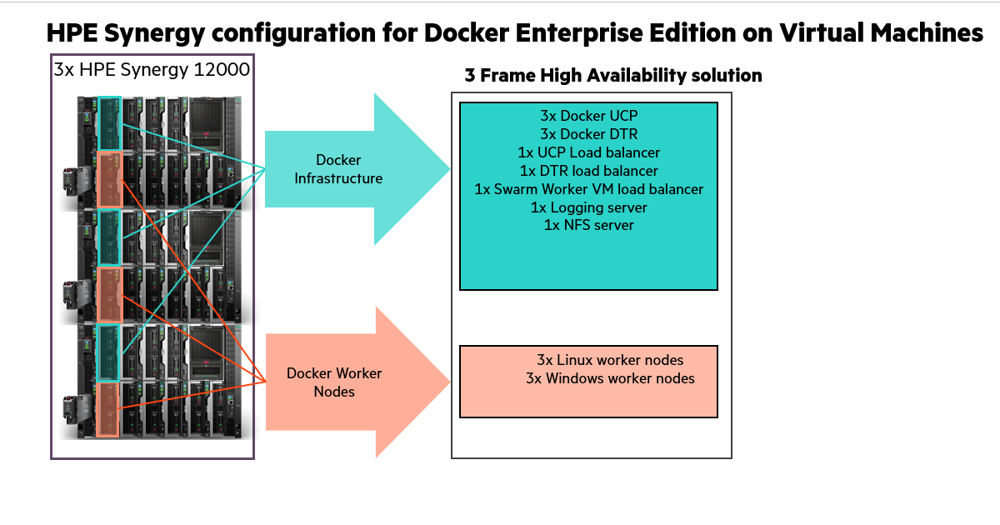

# Introduction

HPE Enterprise Containers as a Service with Docker Enterprise Edition \(EE\) is a complete solution from Hewlett Packard Enterprise that includes all the hardware, software, professional services, and support you need to deploy a containers-as-a-service \(CaaS\) platform, allowing you to get up and running quickly and efficiently. The solution takes the HPE Synergy infrastructure and combines it with Docker’s enterprise-grade container platform, popular open source tools, along with deployment and advisory services from HPE Pointnext.

HPE Enterprise Containers as a Service with Docker EE is ideal for customers migrating legacy applications to containers, transitioning to a container DevOps development model or needing a hybrid environment to support container and non-containerized applications on a common VM platform. HPE Enterprise Containers as a Service with Docker EE provides a solution for IT operations, addressing the need to have a production ready environment that is very easy to deploy and manage.

This document describes the best practices for deploying and operating HPE Enterprise Containers as a Service with Docker EE. It describes how to automate the provisioning of the environment using a set of Ansible playbooks. It also outlines a set of manual steps to harden, secure and audit the overall status of the system.

**Note:** 

The Ansible playbooks described in this document are only intended for Day 0 deployment automation of Docker EE on HPE Synergy.

The Ansible playbooks described in this document are not directly supported by HPE and are intended as an example of deploying Docker EE on HPE Synergy. We welcome input from the user community via GitHub to help us prioritize all future bug fixes and feature enhancements.

## About Ansible

Ansible is an open-source automation engine that automates software provisioning, configuration management and application deployment.

As with most configuration management software, Ansible has two types of servers: the controlling machine and the nodes. A single controlling machine orchestrates the nodes by deploying modules to the nodes over SSH. The modules are temporarily stored on the nodes and communicate with the controlling machine through a JSON protocol over the standard output. When Ansible is not managing nodes, it does not consume resources because no daemons or programs are executing for Ansible in the background. Ansible uses one or more inventory files to manage the configuration of the multiple nodes in the system.

In contrast with other popular configuration management software, such as Chef, Puppet, and CFEngine, Ansible uses an agentless architecture. With an agent-based architecture, nodes must have a locally installed daemon that communicates with a controlling machine. With an agentless architecture, nodes are not required to install and run background daemons to connect with a controlling machine. This type of architecture reduces the overhead on the network by preventing the nodes from polling the controlling machine.

More information about Ansible can be found at: [http://docs.ansible.com](http://docs.ansible.com/)

## About Docker Enterprise Edition

Docker Enterprise Edition \(EE\) is a leading enterprise containers-as-a-service \(CaaS\) software platform for IT that manages and secures diverse applications across disparate infrastructure, both on-premises and in the cloud. Docker EE provides integrated container management and security from development to production. Enterprise-ready capabilities like multi-architecture orchestration and secure software supply chain give IT teams the ability to manage and secure containers without breaking the developer experience.

Docker EE provides:

-    Integrated management of all application resources from a single web admin UI. 
-    Frictionless deployment of applications and Compose files to production in a few clicks. 
-    Multi-tenant system with granular role-based access control \(RBAC\) and LDAP/AD integration. 
-    Self-healing application deployment with the ability to apply rolling application updates. 
-    End-to-end security model with secrets management, image signing and image security scanning. 

More information about Docker Enterprise Edition can be found at: [https://www.docker.com/enterprise-edition](https://www.docker.com/enterprise-edition)

## HPE Synergy

HPE Synergy, the first platform built from the ground up for composable infrastructure, empowers IT to create and deliver new value instantly and continuously. This single infrastructure reduces operational complexity for traditional workloads and increases operational velocity for the new breed of applications and services. Through a single interface, HPE Synergy composes compute, storage and fabric pools into any configuration for any application. It also enables a broad range of applications from bare metal to virtual machines to containers, and operational models like hybrid cloud and DevOps. HPE Synergy enables IT to rapidly react to new business demands.

HPE Synergy Frames contain a management appliance called the HPE Synergy Composer which hosts HPE OneView. HPE Synergy Composer manages the composable infrastructure and delivers:

-    Fluid pools of resources, where a single infrastructure of compute, storage and fabric boots up ready for workloads and demonstrates self-assimilating capacity. 
-    Software-defined intelligence, with a single interface that precisely composes logical infrastructures at near-instant speeds; and demonstrates template-driven, frictionless operations. 
-    Unified API access, which enables simple line-of-code programming of every infrastructure element; easily automates IT operational processes; and effortlessly automates applications through infrastructure deployment. 

# Architecture

By default, the Ansible Playbooks will set up a 3 node environment. HPE and Docker recommend a minimal starter configuration of 3 physical nodes for running Docker in production. This is the minimal configuration that Docker recommends for cluster HA. The distribution of the Docker and non-Docker modules over the 3 physical nodes via virtual machines \(VMs\) is as follows:

-    3 Docker Universal Control Plane \(UCP\) VM nodes for HA and cluster management 
-    3 Docker Trusted Registry \(DTR\) VM nodes for HA of the container registry 
-    3 Docker Swarm Linux worker VM nodes for container workloads 
-    3 Docker Swarm Windows worker VM nodes for container workloads 
-    1 Docker UCP load balancer VM to ensure access to UCP in the event of a node failure 
-    1 Docker DTR load balancer VM to ensure access to DTR in the event of a node failure 
-    1 Docker Swarm Worker node VM load balancer 
-    1 Logging server VM for central logging 
-    1 NFS server VM for storage Docker DTR images 

In addition to the above, the playbooks also set up:

-    Docker persistent storage driver from VMware 
-    Prometheus and Grafana monitoring tools 

These nodes can live in any of the hosts and they are not redundant. The Prometheus and Grafana services are declared in a Docker stack as replicated services with one replica each, so if they fail, Docker EE will ensure that they are restarted on one of the UCP VMs. cAdvisor and node-exporter are declared in the same stack as global services, so Docker EE will ensure that there is always one copy of each running on every machine in the cluster. The vSphere Docker volume plug-in stores data in a shared datastore that can be accessed from any machine in the cluster.

## Server requirements:

Two platforms will be described / tested:

1.  3 node HPE Synergy 480 Gen10 deployment with 1 node in each Synergy frame 
    -    384 GB DDR4-2133 RAM 
    -    2 Intel Xeon CPU Gold 6130 2.10GHz x 16 core 
    -    single ESXi cluster with control plane and docker workers spread out on all 3 nodes 
2.  6 node HPE Synergy 480 Gen 10 deployment with 2 nodes in each Synergy frame 
    -    384GB DDR4-2133 RAM 
    -    2 Intel Xeon CPU Gold 6130 2.10GHz x 16 core 
    -    single ESXi cluster with control plane on 3 nodes and 3 nodes dedicated as Docker workers \(should this be 2 clusters?\) 

TBD: How many workers should be deployed on a single ESXi host dedicated to Docker workers to maximize use of the server and justify the cost of VMware license.

## Storage requirements:

3PAR store required for ESXi datastore \(block storage\)

Currently have 8x 480GB SSD used for datastore

NFS storage - TBD, this needs file persona enabled

will need additional storage for File Persona

!["HPE Synergy Solution"][media-architecture1-png]

[media-architecture1-png]: </media/architecture1.png> "Figure 1. HPE Synergy Solution"



## High availability

Uptime is paramount for any users implementing Docker containers in business critical environments. HPE Enterprise Containers with Docker EE offers various levels of high availability \(HA\) to support continuous availability. All containers including the Docker system containers are protected by Docker’s swarm mode. Swarm mode can protect against individual hardware, network, and container failures based on the user’s declarative model. The Ansible playbooks can be modified to fit your environment and your high availability \(HA\) needs.

### Load Balancers

HPE Enterprise Containers with Docker EE also deploys load balancers in the system to help with container traffic management. There are three load balancer VMs – UCP load balancer, DTR load balancer, and Docker worker node load balancer. Since these load balancers exist in VMs, they have some degree of HA but may incur some downtime during the restoration of these VMs due to a planned or unplanned outage. For optimal HA configuration, the user should consider implementing a HA load balancer architecture using the Virtual Router Redundancy Protocol \(VRRP\). For more information see [http://www.haproxy.com/solutions/high-availability/](http://www.haproxy.com/solutions/high-availability/).

  

## Sizing considerations

A node is a machine in the cluster \(virtual or physical\) with Docker Engine running on it. When provisioning each node, assign it a role: UCP Controller, DTR, or worker node so that it is protected from running application workloads.

To decide what size the node should be in terms of CPU, RAM, and storage resources, consider the following:

1.   All nodes should at least fulfil the minimal requirements, for UCP 2.0, 2GB of RAM and 3GB of storage. More detailed requirements are in the UCP documentation. 
2.   UCP Controller nodes should be provided with more than the minimal requirements, but won’t need much more if nothing else runs on them. 
3.   Ideally, worker node size will vary based on your workloads so it is impossible to define a universal standard size. 
4.   Other considerations like target density \(average number of containers per node\), whether one standard node type or several are preferred, and other operational considerations might also influence sizing. 

If possible, node size should be determined by experimentation and testing actual workloads; and they should be refined iteratively. A good starting point is to select a standard or default machine type in your environment and use this size only. If your standard machine type provides more resources than the UCP Controllers need, it makes sense to have a smaller node size for these. Whatever the starting choice, it is important to monitor resource usage and cost to improve the model.

For HPE Enterprise Containers with Docker EE: Ops Edition, the following tables describe sizing configurations. The vCPU allocations are described in Table 1 while the memory allocation is described in Table 2.

|vCPUs|node01|node02|node03|
|:----|:----:|:----:|:----:|
|ucp1|4| | |
|ucp2| |4| |
|ucp3| | |4|
|dtr1|2| | |
|dtr2| |2| |
|dtr3| | |2|
|worker1|4| | |
|worker2| |4| |
|worker3| | |4|
|win-worker1|4| | |
|win-worker2| |4| |
|win-worker3| | |4|
|ucb\_lb|2| | |
|dtr\_lb| |2| |
|worker\_lb| | |2|
|nfs| | |2|
|logger| |2| |
|Total vCPU per node|12|14|14|

**Note:** 

Note

In the case of one ESX host failure, two nodes are enough to accommodate the amount of vCPU required

|RAM \(GB\)|node01|node02|node03|
|:---------|:----:|:----:|:----:|
|ucp1|8| | |
|ucp2| |8| |
|ucp3| | |8|
|dtr1|16| | |
|dtr2| |16| |
|dtr3| | |16|
|worker1|64| | |
|worker2| |64| |
|worker3| | |64|
|win-worker1|64| | |
|win-worker2| |64| |
|win-worker3| | |64|
|ucb\_lb|4| | |
|dtr\_lb| |4| |
|worker\_lb| | |4|
|nfs| | |4|
|logger| |4| |
|Total RAM required \(per node\)|92|96|96|
|Total RAM required| |284| |
|Available RAM|384|384|384|

**Note:** 

Note

In the case of one ESX host failure, the two surviving hosts can accommodate the amount of RAM required for all VMs.

## Disaster Recovery

In order to protect your installation from disasters, you need to take regular backups of the swarm, UCP and DTR. In the event where half or more manager nodes are lost and cannot be recovered to a healthy state, the system is considered to have lost quorum and can only be restored through the manual procedure described in the Docker documentation.

For more information, see [https://docs.docker.com/datacenter/ucp/2.2/guides/admin/backups-and-disaster-recovery/](https://docs.docker.com/datacenter/ucp/2.2/guides/admin/backups-and-disaster-recovery/).

## Security

The Docker Reference architecture for Securing Docker EE and Security Best Practices is available at [https://success.docker.com/article/Docker\_Reference\_Architecture-\_Securing\_Docker\_EE\_and\_Security\_Best\_Practices](https://success.docker.com/article/Docker_Reference_Architecture-_Securing_Docker_EE_and_Security_Best_Practices)

In addition to having all logs centralized in a single place and the image scanning feature enabled for the DTR nodes, there are other guidelines that should be followed in order to keep your Docker environment as secure as possible. The HPE Reference Configuration paper for securing Docker on HPE Hardware places a special emphasis on securing Docker in DevOps environments and covers best practices in terms of Docker security. The document can be found at: [http://h20195.www2.hpe.com/V2/GetDocument.aspx?docname=a00020437enw](http://h20195.www2.hpe.com/V2/GetDocument.aspx?docname=a00020437enw). Some newer Docker security features that were not covered in the reference configuration are outlined below.

### Prevent tags from being overwritten

By default, an image tag can be overwritten by a user with the correct access rights. As an example, an image such as library/wordpress:latest can be pushed and tagged by different users, yet have different functionality. This might make it difficult to trace back the image to the build that generated it.

Docker DTR can prevent this from happening with the immutable tags feature that can be configured on a per repository basis. Once an image is pushed with a tag, that particular tag cannot be overwritten.

More information about immutable tags can be found at: [https://docs.docker.com/datacenter/dtr/2.3/guides/user/manage-images/prevent-tags-from-being-overwritten/](https://docs.docker.com/datacenter/dtr/2.3/guides/user/manage-images/prevent-tags-from-being-overwritten/%20)

### Isolate swarm nodes to a specific team

With Docker EE Advanced, you can enable physical isolation of resources by organizing nodes into collections and granting Scheduler access for different users. To control access to nodes, move them to dedicated collections where you can grant access to specific users, teams, and organizations.

More information about this subject can be found at: [https://docs.docker.com/datacenter/ucp/2.2/guides/access-control/isolate-volumes-between-teams/](https://docs.docker.com/datacenter/ucp/2.2/guides/access-control/isolate-volumes-between-teams/).

# Provisioning the environment

This section describes in detail how to provision the environment described previously in the architecture section. The high level steps this guide will take are shown in the figure:

   

  

## Creating ESXi hosts with OneView and Image Streamer

OneView/Composer: 10.60.50.10

A 3PAR \(StoreServ 8200 All-Flash\) is used for ESXi cluster storage in the Synergy environment and is connected via FCOE. The 3PAR in the Synergy environment is managed by OneView. Storage for the ESXi cluster can be configured in OneView and assigned in the server profile so that the storage is automatically attached when the server is deployed.

Two volumes are necessary for an ESXi cluster, the large datastore for VM deployments and a smaller \(10GB is fine\) quorum disk. From OneView menu, select Volumes and Create Volume.

-   Specify a unique name for the datastore
-   The storage pool for this environment is ucpa\_r5.
-   Specify a size
-   Select Shared
-   Leave it as Thin provisioned and then select Create.

  

   

Use the server profile template ESXi-6.5 for Docker to create a new server profile for an ESXi host. The server profile template uses the Image Streamer Deployment plan \(ESXi Deployment SAN and Docker enabled\) to deploy ESXi 6.5 and prepare it for use.

   

From the Action drop down menu, select Create the server profile.

You will be asked for

-   Unique Server Profile name
-   Location to deploy \(drop down will give you the list of available compute modules\)

The following attributes are used by the Image Streamer scripts to customize the ESXi 6.5 golden image:

-   Hostname: provide the short name here. It will set the domain to cloudra.local
-   Networking information \(Management network is VLAN60\)

-   -   IP address: provide the IP address on VLAN60.
-   Netmask: 255.255.0.0
-   Gateway: 10.60.0.1
-   DNS1: 10.60.50.106
-   DNS2: 10.60.1.53

   

Note, you have to manually add the hostname + address to the DNS server at 10.60.50.106 since this is not automated.

Storage customization for datastores:

The networks should be set from the template. The networks are configured for High Availability so there are 2 of each:

-   2 Deployment networks which are connected to the Image Streamer
-   2 networks on MGMT1 \(VLAN 60\)
-   2 FC networks for Storage connectivity, SAN-A, SAN-B
-   2 vMotion networks

The Storage may have to be modified depending on which cluster you are joining. If you need different volumes, delete the ones that were added for you and then add the new ones.

   

When you are done with Storage changes, click Create to start the process to create the server profile on the selected compute host.

After the profile is applied, use the Actions drop down to power on the server.

As it powers on you will probably see connectivity error messages such as this:

   

This error will \(should!\) clear once the server boots completely.

Use the Actions Drop down to open the iLO session to verify the server booted completely.

   

You should see the hostname and the IP set as specified in the server profile. After we get this host into vCenter and deploy the vSphere docker plugin we will use the iLO to restart the hostd service.

Additional networking \(ie vMotion\) , distributed switches, attaching the datastore, etc is all manual setup using the vSphere client. All vCenter setup is manual \(vcenter.cloudra.local/10.60.50.103\). There are some licenses for compute hosts available though they all expire in March 2018.

## Deploying the vSphere Volume PlugIn:

**Editors Note**: I had attempted to add the vSphere Volume plugin to the ESXi golden image but it does not work. I have reported this issue to the Image Streamer team. The ESXi 6.5 image can't be modified. All changes are lost as soon as it reboots. The existing Image Streamer capture ESXi scripts to create golden images which are supposed to remove all customizations also do not work. The only thing I could get to work is creating the "vanilla" ESXi 6.5 golden image and using the existing Image Streamer scripts to do the customization. Therefore, the addition of the vSphere Volume Plugin is not automated. Using the vSphere Update Manager seemed like the best option however even that requires additional steps as the package provided by VMware doesn't restart the hostd service and the plugin is unusable until you do that.

After the new ESXi host is imported into vCenter, you can use the vSphere Update manager to install the vSphere Volume PlugIn.

-   From vSphere Web Client, select your ESXi host
-   Select the Update Manager tab

   

-   Attach the baseline "ESXi 6.5 Docker Patch Extension" to your host.

   

-   Select Scan for Updates and choose Patches and Extensions

   

   

-   Select Remediate - you should see the VDVS\_Driver BuiltIn

   

-   Keep the defaults for the Advanced and remediation options, click Finish. It doesn't refresh automatically but you can select anything else and return to this page and it should show that host is now compliant.

   

The Docker Extension is now installed on the ESXi host but you have to restart the service in order to use it. Going back to the iLO session, you can select Alt F1 to go to the CLI and restart the hostd service. After logging in, enter

-   /etc/init.d/hostd restart

   

If you use the esxcli storage guestvol command you can now see the status.

   

## Verify prerequisites

You must assemble the information required to assign values for each and every variable used by the playbooks, before you start deployment. The variables are fully documented in the following sections “Editing the group variables” and “Editing the vault”. A summary of the information required is presented in Table 3.

Table 3. Summary of information required

| Component

 | Details

 |
|-------------|-----------|
| Virtual Infrastructure

 | The FQDN of your vCenter server and the name of the Datacenter. You will also need administrator credentials in order to create templates, and spin up virtual machines.

 |
| L3 Network requirements

 | You will need one IP address for each and every VM configured in the Ansible inventory \(see the section “Editing the inventory”\). At the time of writing, the example inventory configures 14 virtual machines so you would need to allocate 14 IP addresses to use this example inventory. Note that the Ansible playbooks do not support DHCP so you need static IP addresses. All the IPs should be in the same subnet. You will also have to specify the size of the subnet \(for example /22 or /24\) and the L3 gateway for this subnet.

 |
| DNS

 | You will need to know the IP addresses of your DNS server. In addition, all the VMs you configure in the inventory should have their names registered in DNS. In addition, you will need the domain name to use for configuring the virtual machines \(such as [example.com](http://example.com/)\)

 |
| NTP Services

 | You need time services configured in your environment. The solution being deployed \(including Docker\) uses certificates and certificates are time sensitive. You will need the IP addresses of your time servers \(NTP\).

 |
| RHEL Subscription

 | A RHEL subscription is required to pull extra packages that are not on the DVD.

 |
| Docker Prerequisites

 | You will need a URL for the official Docker EE software download and a license file. Refer to the Docker documentation to learn more about this URL and the licensing requirements at: [https://docs.docker.com/engine/installation/linux/docker-ee/rhel/](https://docs.docker.com/engine/installation/linux/docker-ee/rhel/) in the section entitled “Docker EE repository URL”

 |
| Proxy

 | The playbooks pull the Docker packages from the Internet. If your environment accesses the Internet through a proxy, you will need the details of the proxy including the fully qualified domain name and the port number.

 |

## Enable vSphere High Availability

You must enable vSphere High Availability \(HA\) to support virtual machine failover during an HA event such as a host failure. Sufficient CPU and memory resources must be reserved across the system so that all VMs on the affected host\(s\) can fail over to remaining available hosts in the system. You configure an Admission Control Policy \(ACP\) to specify the percentage CPU and memory to reserve on all the hosts in the cluster to support HA functionality.

**Note:** 

Note

You should not use the default Admission Control Policy. Instead, you should calculate the memory and CPU requirements that are specific to your environment.

## Install vSphere Docker Volume Service driver on all ESXi hosts

vSphere Docker Volume Service technology enables stateful containers to access the storage volumes. This is a one-off manual step. In order to be able to use Docker volumes using the vSphere driver, you must first install the latest release of the vSphere Docker Volume Service \(vDVS\) driver, which is available as a vSphere Installation Bundle \(VIB\). To perform this operation, log in to each of the ESXi hosts, download and install the latest release of vDVS driver.

```
# esxcli software vib install -v /tmp/vmware-esx-vmdkops-<version>.vib --no-sig-check
```

More information on how to download and install the driver can be found at [http://vmware.github.io/vsphere-storage-for-docker/documentation/install.html](http://vmware.github.io/vsphere-storage-for-docker/documentation/install.html)

**Note:** 

Note:

You cannot mount the same persistent volume created through vSphere Docker Volume Service \(vDVS\) on containers running on two different hosts at the same time.

## Install vSphere Docker Volume Service driver for Windows

VMware read me confirms that the same docker vsphere plugin we are using for Linux is supported for Docker \(Docker for Windows\) version 17.06.[https://github.com/vmware/vsphere-storage-for-docker/blob/master/README.md](https://github.com/vmware/vsphere-storage-for-docker/blob/master/README.md)

Docker \(Windows\): 17.06 and above \(Windows containers mode only\)

Following location has version 0.21 of the windows software packaged in a Zip file, please note this is a development branch. [https://bintray.com/vmware/vDVS/VDVS\_Windows](https://bintray.com/vmware/vDVS/VDVS_Windows)vsphere-storage-for-docker\_windows\_0.21.zip

Image will need to be downloaded and installed direct from curl -L "https://vmware.bintray.com/vDVS/<FILE\_PATH\>" -o <FILE.EXT\>

Unpack vsphere-storage-for-docker\_windows\_0.20.zip - ZIP archive, unpacked size 5,884,055 bytes on each of the windows worker nodes.

1.  Unzip file and then execute program.execute cmd.exe /C unzip -o Source\*.zip -d Destination ;
2.  Run executable vdvs.exe, on each of the windows worker nodes this is dependent on [VDI-1515](https://jira.simplivt.local:8443/browse/VDI-1515) being finished.
3.  Test scenario; Run docker info command to check that the storage vdvs plugin is available, then spin up a container with an attached volume, check you can create data within the volume.

## Create the Red Hat Linux Template

The section explains how to create the Red Hat Linux VM Template that you will use as the base for all your nodes. In order to create a VM Template you will first create a Virtual Machine with the OS installed and then convert the Virtual Machine to a VM Template. Since the goal of automation is to remove as many repetitive tasks as possible, the VM Template is created as lean as possible, with any additional software installs and/or system configuration performed subsequently using Ansible.It would be possible to automate the creation of the template. However, as this is a one-off task, it is appropriate to do it manually. The steps to create a VM template manually are described below.

1.   Log in to vCenter and create a new Virtual Machine with the following characteristics: 

1.  1.   Guest OS Family: Linux, Guest OS Version: Red Hat Enterprise Linux \(64-bit\) 
    -    Hard Disk size: 50GB, \(Thin provisioning\) 
    -    A single network controller connected to the network or VLAN of your choice. All VMs will connect to this same network. 
    -    Optionally you can remove the floppy drive  
2.   Install Red Hat Enterprise 7 
    1.   select a language which is selected by Docker 
    2.   For the software selection, choose **Infrastructure Server** as the base environment and add the **Guest Agents** from the lists of add-ons available for this environment. The Infrastructure Server environment is selected here versus the Minimal Install because Customization of Linux guest operating systems requires that Perl is installed in the Linux guest operating system. 
    3.   Configure the network settings so that you can later access the VM using SSH. Specify and IP address for the network interface, a default gateway, DNSs settings and possibly HTTP/HTTS proxy that apply in your environment. 
    4.   Specify a password for the root account and optionally created an admin user 
    5.   wait for the installation to finish and the VM to reboot. 

## Configure the yum repositories

 The Red Hat packages required during the deployment of the solution come from two repositories: `rhel-7-server-rpms`and `rhel 7-server-extras-rpms`. The first repository can be found on the Red Hat DVD but the second cannot. There are two options, with both options requiring a Red Hat Network account. Logon in your VM template using SSH using the credentials you configured for the root account and implement one of the two options below: 

 **Option 1:** Use Red Hat subscription manager to register your system. This is the easiest way and will automatically give you access to the official Red Hat repositories. Use the `subscription-manager register` command as follows. 

```
# subscription-manager register --auto-attach
```

 If you are behind a proxy, you must configure this before running the above command to register. 

```
# subscription-manager config --server.proxy_hostname=<proxy IP> --server.proxy_port=<proxy port>
```

 Verify that you don't have the issue described here: [https://access.redhat.com/solutions/3317671](https://access.redhat.com/solutions/3317671) by entering the following command. 

```
# yum repolist
```

```
If you have the issue, fix it with the following command
```

```
# subscription-manager repos --disable=rhel-7-server-rt-beta-rpms
```

The playbooks will later automatically enable the `extras` repository on the VMs that need it.

  ****  

 **Option 2:** Use an internal repository. Instead of pulling the packages from Red Hat, you can create copies of the required repositories on a dedicated node. You can then configure the package manager to pull the packages from the dedicated node. Your `/etc/yum.repos.d/redhat.repo` could look as follows. 

```
[RHEL7-Server] name=Red Hat Enterprise Linux $releasever - $basearch baseurl=http://yourserver.example.com/rhel-7-server-rpms/ enabled=1 gpgcheck=1 gpgkey=file:///etc/pki/rpm-gpg/RPM-GPG-KEY-redhat-release [RHEL7-Server-extras] name=Red Hat Enterprise Linux Extra pkg $releasever - $basearch baseurl=http://yourserver.example.com/rhel-7-server-extras-rpms/ enabled=1 gpgcheck=1 gpgkey=file:///etc/pki/rpm-gpg/RPM-GPG-KEY-redhat-release
```

```

```

 The following articles explain how you can create a local mirror of the Red Hat repositories and how to share them.[https://access.redhat.com/solutions/23016](https://access.redhat.com/solutions/23016)  [https://access.redhat.com/solutions/7227](https://access.redhat.com/solutions/7227)  

 Before converting the VM to a template, you will need to setup access for the Ansible host to configure the individual VMs. This is explained in the next section. 

## Create the Windows Template

The section explains how to create the Windows VM Template that you will use as the base for all your Windows nodes. In order to create a VM Template you will first create a Virtual Machine with the OS installed and then convert the Virtual Machine to a VM Template. Since the goal of automation is to remove as many repetitive tasks as possible, the VM Template is created as lean as possible, with any additional software installs and/or system configuration performed subsequently using Ansible.It would be possible to automate the creation of the template. However, as this is a one-off task, it is appropriate to do it manually. The steps to create a VM template manually are described below.

1.   Log in to vCenter and create a new Virtual Machine with the following characteristics: 

1.  1.   Guest OS Family: Windows, Guest OS Version: Microsoft Windows Server 2016 \(64-bit\) 
    -    Hard Disk size: 50GB, \(Thin provisioning\) 
    -    A single network controller connected to the network or VLAN of your choice. All VMs will connect to this same network. 
    -    You should change your network type to VMXNET3, and attach the windows 2016 ISO image from a datastore ensuring you connect the CD/DVD drive on boot. 
    -   Don’t forget to click on the VM Options tab, and in the Boot Options section, select Force BIOS setup\(\*\) to ensure that the machine enters the BIOS setup screen on next boot of this VM. This will allow you to adjust the boot order, placing the virtual CDROM in front of your hard drive.
    -    Optionally you can remove the floppy drive  
2.  Install Windows 2016

-   -   Now we can power on the selected VM. Then Open Console.
-   Once connected to the console you will be placed in the BIOS setup screen, tab over to the Boot tab, click on CD-ROM Drive and hit the + sign which will move up the CDROM drive above the Hard drive which allows your Windows 2016 ISO image to be loaded first on boot. F10 Save and exit is next step.
-   Enter your choises for Language, Time/Currency Format, Keyboard and then Install Now
-   Select the OS you want to install, and then select Custom: Install Windows Only
-   Select drive 0, the 50 GB drive you specified earlier, as the location for installing windows
-   Add a password for the Administrator user, install VMware Tools and reboot
-   Once rebooted add a temporary network IP address.
-   Using sconfig utility from \(Dos\) command line:
    -   Install windows updates.
    -   Enable remote desktop.
-   Perform any other customisations you require at this point.
-   Prior to converting a VM to Template, just remember to use Sysprep: C:\\Windows\\System32\\Sysprep\\Sysprep.exe
    -   Ensure ‘System Out-of-Box Experience \(OOBE\)’ is selected
    -   Select the ‘Generalise’ option
    -   Select ‘Shutdown’ from the Shutdown Options.
-   Shutdown VM, and untick the connect CD/DVD so that the Windows 2016 ISO no longer going to be mounted.
-   Convert VM to Template

## Create the Ansible node

In addition to the VM Template, you need another Virtual Machine where Ansible will be installed. This node will act as the driver to automate the provisioning of the environment and it is essential that it is properly installed. The steps are as follows:

1.  Create a Virtual Machine and install your preferred OS \(in this example, and for the sake of simplicity, RHEL7 will be used\). The rest of the instructions assume that, if you use a different OS, you understand the possible differences in syntax for the provided commands. If you use RHEL 7, select Infrastructure Server as the base environment and the Guests Agentsadd-on during the installation.
2.  ```
Log in to the root account and create an SSH key pair. Do not protect the key with a passphrase (unless you want to use ssh-agent).
```

    ```
    # ssh-keygen
    ```

3.  Configure the following yum repositories, rhel-7-server-rpms and rhel-7-server-extras-rpms as explained in [https://confluence.simplivt.local/display/PE/Create+the+Linux+Red+Hat+Template](https://confluence.simplivt.local/display/PE/Create+the+Linux+Red+Hat+Template)the "extras" repo can be enabled with:

    ```
    # subscription-manager repos --enable=rhel-7-server-extras-rpms
    ```

4.  Configure the EPEL repository. For more information, see: [http://fedoraproject.org/wiki/EPEL](http://fedoraproject.org/wiki/EPEL). Note that yum-config-manager comes with the Infrastructure Server base environment, if you did not select this environment you will have to install the yum-utils package.

    ```
    # rpm -ivh https://dl.fedoraproject.org/pub/epel/epel-release-latest-7.noarch.rpm # yum-config-manager --enable rhel-7-server-extras-rpms
    ```

5.  Install Ansible. The playbooks require Ansible 2.4.2 and above

    ```
    # yum install ansible
    ```

6.  Make a list of all the hostnames and IPs that will be in your system and update your `/etc/hosts` file accordingly. This includes your UCP nodes, DTR nodes, worker nodes, NFS server, logger server and load balancers.
7.  Install the following packages which are a mandatory requirement for the playbooks to function as expected. \(Update pip if requested\).

    ```
    # yum install python-pyvmomi python-netaddr python2-jmespath python-pip gcc python-devel openssl-devel git # pip install --upgrade pip # pip install cryptography # pip install pysphere # pip install "pywinrm>=0.2.2"
    ```

8.  Copy your SSH public key to the VM Template so that, in the future, your Ansible node can SSH without the need of a password to all the Virtual Machines created from the VM Template.

    ```
    # ssh-copy-id root@<VM_Template>
    ```


Please note that in both the Ansible node and the VM Template you might need to configure the network so one node can reach the other. Instructions for this step have been omitted since it is a basic step and could vary depending on the user’s environment.

## Finalize the template

From the root account in the ansible box:

1\) Copy the SSH public key you created on your ansible box to the VM Template so that, in the future, your Ansible node can SSH without the need of a password to all the Virtual Machines created from the VM Template.

```
ssh-copy-id root@<IP of your VM_Template>
```

Now that the VM Template has the public key of the Ansible node, we’re ready to convert this VM to a VM Template. Perform the following steps in the VM Template to finalize its creation:

 2\) Clean up the template by running the following commands from the **Virtual Machine Console** 

```
# rm /etc/ssh/ssh_host_*# nmcli con del ens192# logrotate -f /etc/logrotate.conf
```

```
# rm /var/log/*-201?*
```

```
# history -c
```

 3\) Shutdown the VM 

```
# shutdown -h now
```

 4\) Once the Virtual Machine is ready and turned off, convert it to a template 

 This completes the creation of the VM Template. 

## Prepare your Ansible configuration

On the Ansible node, retrieve the latest version of the playbooks using git.

```

					`# git clone <repository>`
				
```

Change to the directory which you just cloned:

 `# cd ~/Docker-Synergy` 

Change to the `ops` directory:

 `# cd ops` 

Note: File names are relative to the `ops` directory. For example `vm_hosts` is located in `~/Docker-Synergy/ops` and `group_vars/vars` relates to `~/Docker-Synergy/ops/groups_vars/vars`.

You now need to prepare the configuration to match your own environment, prior to deploying Docker EE and the rest of the nodes. To do so, you will need to edit and modify three different files:

-   `vm_hosts` \(the inventory file\)
-   `group_vars/vars` \(the group variables file\)
-   `group_vars/vault` \(the encrypted group variable file\)
-   `group_vars/win_worker.yml` \(the encrypted group windows remote management variable file\)

You should work from the root account for the configuration steps and later when you run the playbooks.

## Editing the inventory

The inventory is the file named `vm_hosts` in the `~Docker-Synergy/ops` directory. You need to edit this file to describe the configuration you want to deploy.

The nodes inside the inventory are organized in groups. The groups are defined by brackets and the group names are static so they must not be changed. Anything else \(hostnames, specifications, IP addresses…\) are meant to be amended to match the user needs. The groups are as follows:

-   \[ucp\_main\]: A group containing one single node which will be the main UCP node and swarm leader. Do not add more than one node under this group.
-   \[ucp\]: A group containing all the UCP nodes, including the main UCP node. Typically you should have either 3 or 5 nodes under this group.
-   \[dtr\_main\]: A group containing one single node which will be the first DTR node to be installed. Do not add more than one node under this group.
-   \[dtr\]: A group containing all the DTR nodes, including the main DTR node. Typically you should have either 3 or 5 nodes under this group.
-   \[worker\]: A group containing all the worker nodes. Typically you should have either 3 or 5 nodes under this group.
-   \[win\_worker\]: A group containing all the windows worker nodes. Typically you should have either 3 or 5 nodes under this group.
-   \[ucp\_lb\]: A group containing one single node which will be the load balancer for the UCP nodes. Do not add more than one node under this group.
-   \[dtr\_lb\]: A group containing one single node which will be the load balancer for the DTR nodes. Do not add more than one node under this group.
-   \[worker\_lb\]: A group containing one single node which will be the load balancer for the worker nodes. Do not add more than one node under this group.
-   \[lbs\]: A group containing all the load balancers. This group will have 3 nodes, also defined in the three groups above.
-   \[nfs\]: A group containing one single node which will be the NFS node. Do not add more than one node under this group.
-   \[logger\]: A group containing one single node which will be the logger node. Do not add more than one node under this group.
-   \[local\]: A group containing the local Ansible host. It contains an entry that should not be modified.

There are also a few special groups:

-   \[docker:children\]: A group of groups including all the nodes where Docker will be installed.
-   \[vms:children\]: A group of groups including all the Virtual Machines involved apart from the local host.

Finally, you will find some variables defined for each group:

-   \[vms:vars\]: A set of variables defined for all VMs. Currently only the size of the boot disk is defined here.
-   \[ucp:vars\]: A set of variables defined for all nodes in the \[`ucp`\] group.
-   \[dtr:vars\]: A set of variables defined for all nodes in the \[`dtr`\] group.
-   \[worker:vars\]: A set of variables defined for all nodes in the \[`worker`\] group.
-   \[win\_worker:vars\]: A set of variables defined for all nodes in the \[win\_`worker`\] group.
-   \[lbs:vars\]: A set of variables defined for all nodes in the \[`lbs`\] group.
-   \[nfs:vars\]: A set of variables defined for all nodes in the \[`nfs`\] group.
-   \[logger:vars\]: A set of variables defined for all nodes in the \[`logger`\] group.

If you wish to configure your nodes with different specifications rather than the ones defined by the group, it is possible to declare the same variables at the node level, overriding the group value. For instance, you could have one of your workers with higher specifications by doing:

```

					`[worker] worker01 ip_addr='10.0.0.10/16' esxi_host='esxi1.domain.local' worker02 ip_addr='10.0.0.11/16' esxi_host='esxi1.domain.local' worker03 ip_addr='10.0.0.12/16' esxi_host='esxi1.domain.local' cpus='16' ram'32768' [worker:vars] cpus='4' ram='16384' disk2_size='200'`
				
```

In the example above, the `worker03` node would have 4 times more CPU and double the RAM compared to the rest of the worker nodes.

The different variables you can use are as described in Table 4 below. They are all mandatory unless if specified otherwise.

Table 4. Variables

|Variable|Scope|Description|
|--------|-----|-----------|
|ip\_addr|Node|IP address in CIDR format to be given to a node|
|esxi\_host|Node|ESXi host where the node will be deployed. If the cluster is configured with DRS, this option will be overriden|
|cpus|Node/Group|Number of CPUs to assign to a VM or a group of VMs|
|ram|Node/Group|Amount of RAM in MB to assign to a VM or a group of VMs|
|disk2\_usage|Node/Group|Size of the second disk in GB to attach to a VM or a group of VMs. This variable is only mandatory on Docker nodes \(UCP, DTR, worker\) and NFS node. It is not required for the logger node or the load balancers.|

## Editing the group variables

Once the inventory is ready, the next step is to modify the group variables to match your environment. To do so, you need to edit the file `group_vars/vars`. The variables can be defined in any order but for the sake of clarity they have been divided into sections.

### VMware configuration

All VMware-related variables are mandatory and are described in Table 5.

Table 5. VMware variables

|Variable|Description|
|--------|-----------|
|vcenter\_hostname|IP or hostname of the vCenter appliance|
|vcenter\_username|Username to log in to the vCenter appliance. It might include a domain, for example, '[administrator@vsphere.local](mailto:administrator@vsphere.local)'. Note: The corresponding password is stored in a separate file \(`group_vars/vault`\) with the variable named `vcenter_password`.|
|vcenter\_validate\_certs|‘no’|
|datacenter|Name of the datacenter where the environment will be provisioned|
|vm\_username|Username to log into the VMs. It needs to match the one from the VM Template, so unless you have created an user, you must use 'root'. Note: The corresponding password is stored in a separate file \(`group_vars/vault`\) with the variable named `vm_password`.|
|vm\_template|Name of the RHEL VM Template to be use. Note that this is the name from a vCenter perspective, not the hostname.|
|win\_vm\_template|Name of the Windows 2016 VM Template to use. Note that this is the name from a vCenter perspective, not the hostname.|
|folder\_name|vCenter folder to deploy the VMs. If you do not wish to deploy in a particular folder, the value should be `/`. Note: If you want to deploy in a specific folder, you need to create this folder in the inventory of the selected datacenter before starting the deployment.|
|datastores|List of datastores to be used, in list format, i.e. \['`Datastore1`','`Datastore2`'...\]. This or these datastore\(s\) must exist before you run the playbooks.|
|disk2|UNIX® name of the second disk for the Docker VMs. Typically `/dev/sdb`|
|disk2\_part|UNIX name of the partition of the second disk for the Docker VMs. Typically `/dev/sdb1`|
|vsphere\_plugin\_version|Version of the vSphere plugin for Docker. The default is 0.20 which is the latest version at the time of writing this document. The version of the plugin should match the version of the vSphere Installation Bundle \(VIB\) that you installed on the ESXi servers.|
|vm\_portgroup|TODO|

### Networking configuration

All network-related variables are mandatory and are described in Table 7.

Table 7. Network variables

|Variable|Description|
|--------|-----------|
|nic\_name|Name of the device, for RHEL this is typically `ens192` and it is recommended to leave it as is.|
|gateway|IP address of the gateway to be used|
|dns|List of DNS servers to be used, in list format, i.e. \['`10.10.173.1`','`10.10.173.2`'...\]|
|domain\_name|Domain name for your Virtual Machines|
|ntp\_server|List of NTP servers to be used, in list format, i.e. \['`1.2.3.4`','`[0.us.pool.net.org](http://0.us.pool.net.org/)`'...\]|

### Docker configuration

All Docker-related variables are mandatory and are described in Table 8.

|Variable|Description|
|--------|-----------|
|docker\_ee\_url|Note: This is a private link to your Docker EE subscription. This should be kept secret and defined in `group_vars/vault`. The value for `docker_ee_url` is the URL documented at the following address: [https://docs.docker.com/engine/installation/linux/docker-ee/rhel/](https://docs.docker.com/engine/installation/linux/docker-ee/rhel/).|
|rhel\_version|Version of your RHEL OS, such as `7.4`. The playbooks were tested with RHEL 7.3. and RHEL 7.4.|
|dtr\_version|Version of the Docker DTR you wish to install. You can use a numeric version or `latest` for the most recent one. The playbooks were tested with 2.3.3. and 2.4.0.|
|ucp\_version|Version of the Docker UCP you wish to install. You can use a numeric version or `latest` for the most recent one. The playbooks were tested with UCP 2.2.3. and 2.2.4.|
|images\_folder|Directory in the NFS server that will be mounted in the DTR nodes and that will host your Docker images.|
|license\_file|Full path to your Docker EE license file \(it should be stored in your Ansible host\).License file is available from the Docker Store|
|ucp\_username|Username of the administrator user for UCP and DTR, typically `admin`. Note: The corresponding password is stored in a separate file \(`group_vars/vault`\) with the variable named `ucp_password`.|
|enable\_windows|If `true`, the creation of Windows 2016 worker nodes will be actioned. The default value is `false`.|

### Monitoring configuration

All Monitoring-related variables are described in Table 9. The variables determine the versions of various monitoring software tools that are used and it is recommended that the values given below are used.

|Variable|Description|
|--------|-----------|
|cadvisor\_version| `v0.25.0` |
|node\_exporter\_version| `v1.14.0` |
|prometheus\_version| `v1.7.1` |
|grafana\_version| `4.4.3` |
|prom\_persistent\_vol\_name|The name of the volume which will be used to store the monitoring data. The volume is created using the vsphere docker volume plugin.|
|prom\_persistent\_vol\_size|The size of the volume which will hold the monitoring data. The exact syntax is dictated by the vSphere Docker Volume plugin. The default value is 10GB.|

### Logspout configuration

Logspout is a log router for Docker containers that runs inside Docker. It attaches to all containers on a host, then routes their logs to the central logging VM. All Logspout-related variables are described in Table 10.

Table 10. Logspout variables

|Variable|Description|
|--------|-----------|
|logspout\_version|`‘master’` More details on Logspout are available later in this document.|

### Environment configuration

All Environment-related variables should be here. All of them are described in the Table 11 below.

Table 11. Environment variables

|Variable|Description|
|--------|-----------|
|env|Dictionary containing all environment variables. It contains three entries described below. Please leave empty the proxy related settings if not required:-   http\_proxy: HTTP proxy URL, such as '[http://15.184.4.2:8080](http://15.184.4.2:8080/)'. This variable defines the HTTP proxy url if your environment is behind a proxy.
-   https\_proxy: HTTP proxy URL, such as '[http://15.184.4.2:8080](http://15.184.4.2:8080/)'. This variable defines the HTTPS proxy url if your environment is behind a proxy.
-   no\_proxy: List of hostnames or IPs that don't require proxy, such as 'localhost,127.0.0.1,.cloudra.local,10.10.174.'

|

## Editing the vault

Once your group variables file is ready, the next step is to create a vault file to match your environment. The vault file is essentially the same thing than the group variables but it will contain all sensitive variables and will be encrypted.

There is a sample vault file named `group_vars/vault.sample` that you can use as a model for your vault file. To create a vault, you create a new file `group_vars/vault` and add entries similar to:

```

					`--- vcenter_password: 'xxx' docker_ee_url: 'yoururl' vm_password: 'xxx' ucp_password: 'xxx' rhn_orgid: 'Red Hat Organization ID' rhn_key: 'Red Hat Activation Key'`
				
```

`rhn_orgid` and `rhn_key` are the credentials needed to subscribe the virtual machines with Red Hat Customer Portal. For more info regarding activation keys see the following URL: [https://access.redhat.com/articles/1378093](https://access.redhat.com/articles/1378093)

To encrypt the vault you need to run the following command:

```

					`# ansible-vault encrypt group_vars/vault`
				
```

You will be prompted for a password that will decrypt the vault when required. You can update the values in your vault by running:

```

					`# ansible-vault edit group_vars/vault`
				
```

For Ansible to be able to read the vault, you need to specify a file where the password is stored, for instance in a file called `.vault_pass`. Once the file is created, take the following precautions to avoid illegitimate access to this file:

1.  Change the permissions so only `root` can read it using `# chmod 600 .vault_pass` 
2.  Add the file to your `.gitignore` file if you're pushing the set of playbooks to a git repository.

###  **Windows playbooks configuration** 

The Windows playbooks use a special encrypted file called win\_worker.yml

Used by:

-   create\_windows\_vms.yml
-   install\_docker\_window.yml
-   scale\_workers\_windows.yml

Description:

-   these are used by win remote management module winRM, ansible communicates over port 5986 to remote windows virtual machines.

Example:

-   ansible\_user: Administrator
-   ansible\_password: "\{Enter Password here\}"
-   ansible\_port: 5986
-   ansible\_connection: winrm
-   ansible\_winrm\_server\_cert\_validation: ignore
-   ansible\_winrm\_operation\_timeout\_sec: 250
-   ansible\_winrm\_read\_timeout\_sec: 300
-   windows\_timezone: 15

## Using Customer supplied certificates for UCP and DTR

### Variables

**ucp\_certs\_dir:** in group\_vars/vars,

-   if **ucp\_certs\_dir** is not defined, UCP is installed with self-signed certificates and DTR is installed with the --ucp-insecure-tls switch
-   If **ucp\_certs\_dir** is defined, it should points to a folder on the ansible machine which should contain 3 files

-   -   ca.pem, this is the root CA certificate in PEM format
-   cert.pem, this is the server certificate optionally followed by intermediate CAs
-   key.pem, this is the private key that comes with the cert.pem certificates

**dtr\_certs\_dir:** in group\_vars/vars,

-   if dtr**\_certs\_dir** is not defined, DTR is installed with self-signed certificates
-   if **dtr\_certs\_dir** is defined, this variable points to a folder on the ansible machine which should contain 3 files
    -   ca.pem, this is the root CA certificate in PEM format
    -   cert.pem, this is the DTR server certificate optionally followed by intermediate CAs
    -   key.pem, this is the private key that comes with the cert.pem certificates

**Note that the installation will fail if** the ca.pem, cert.pem and key.pem cannot be found in the folders designated by dtr\_certs\_dir and ucp\_certs\_dir or if they don;t constitute valid certificates. Note that there is an ansible module that would help verifying the validity of the certificates byt it requires a version of PyOpenSSL which is not compatible with the version installed on Red Hat 7.4 \(PyOpenSSL is required by RH subscription manager\)

